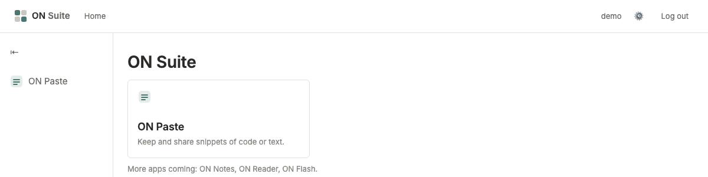
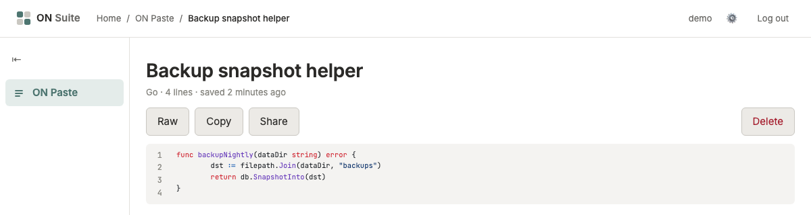

# ON Suite

ON Suite is a self-hosted suite of small web applications for personal use —
one account, one shell, one SQLite file, one Go binary. Each app carries the
"ON" prefix: ON Paste, ON Notes, ON Reader, ON Flash.

It is built for a household, not a company: the author plus a handful of
family and friends, invite-only, no public sign-up, no multi-tenant hardening.
If you're looking for a SaaS-scale platform this isn't it — it's the opposite
bet, optimised for "one binary, one data directory, nothing else to run."

<p align="center">
  
  
</p>

Of the four apps the "ON" prefix is reserved for, two are built and registered
today. **ON Paste** holds snippets of code or text, with syntax highlighting
and shareable links. **ON Notes** is a hierarchical outliner — one infinite
tree per account, with zoom, collapse and every structural operation; the
keyboard layer, Markdown, due dates and search are still being built out. ON
Reader and ON Flash are future work: the platform and app framework are ready
for them, but no code exists yet.

## Is this for you?

- **You want to self-host something small for yourself and a few people you
  trust**, and you'd rather manage one binary and one SQLite file than a pile
  of Docker Compose services. → Read [Getting started](#getting-started)
  below, then [Deploying](docs/DEPLOYING.md).
- **You want to run it, and maybe also change it or add an app.** → Same
  starting point, then [Contributing](CONTRIBUTING.md) for the ground rules
  (no CGO, no Node, the platform/app boundary) before you dive into the code.
- **You're just browsing.** → The rest of this README explains what it is and
  why it's built this way; no need to go further unless something here is
  useful to you.

## Getting started

Requirements: Go 1.26 or newer, and nothing else — no Docker, no Node, no
database server to install. SQLite is a pure-Go dependency
(`modernc.org/sqlite`), so `CGO_ENABLED=0` always holds.

```bash
git clone https://github.com/iliafrenkel/on-suite.git
cd on-suite
go build ./cmd/onsuite
```

Create the first account (prompts for a password, twice, without echoing it):

```bash
./onsuite user add ilia --admin --data-dir ./data
```

Start the server:

```bash
./onsuite serve --data-dir ./data
```

Every flag has an `ONSUITE_*` environment variable equivalent (e.g.
`--addr` / `ONSUITE_ADDR`, `--data-dir` / `ONSUITE_DATA_DIR`). Run
`./onsuite serve -h` for the full list, or `./onsuite help` for all commands.

Confirm it's up, then open `http://localhost:8080/` in a browser:

```bash
curl -s localhost:8080/healthz
```

You'll be redirected to `/login`; sign in with the account you just created
and you'll land on the dashboard, with your username and a working log-out
button in the top bar, and ON Notes and ON Paste in the app switcher.

Cross-compiling for a Linux server from any machine needs nothing extra,
since there's no CGO to worry about:

```bash
CGO_ENABLED=0 GOOS=linux GOARCH=arm64 go build -o onsuite ./cmd/onsuite
```

**Running this somewhere real?** See [Deploying ON Suite](docs/DEPLOYING.md)
for a systemd unit, choosing between a reverse proxy and built-in TLS,
backups and restores, upgrades, and a Docker option.

## Why

Most self-hosted app suites are either a pile of Docker Compose services each
with their own database, or a SaaS product wearing a self-host badge. ON Suite
is neither: one Go binary, one SQLite file, no Node, no npm, no JavaScript
build step, no CGO. `go build ./cmd/onsuite` is the entire build, and the
result runs the same way on a Raspberry Pi as it does on a laptop.

## Design at a glance

- **One binary, one module.** Every app is compiled in and always enabled;
  there is no plugin loading and no per-app deployment.
- **One SQLite file**, opened with `journal_mode=WAL`, `busy_timeout=5000`,
  `foreign_keys=ON`, and a single connection (`SetMaxOpenConns(1)`), which
  trades write concurrency this deployment will never need for eliminating
  "database is locked" as a class of bug.
- **Forward-only migrations**, embedded with `go:embed`, applied in a
  transaction at startup. Each app owns and numbers its own migrations under
  its own namespace (`paste:0001`), so apps never coordinate schema changes
  with each other.
- **The platform never imports an app, and apps never import each other.**
  Apps import only `internal/platform/*` and `internal/ui`. An architecture
  test walks the whole import graph and fails the build if either rule is
  broken.
- **Argon2id passwords, invite-only accounts.** No public registration.
  Passwords are never passed as a CLI flag (visible in `ps` and shell
  history) — `onsuite user add` reads from a terminal with echo disabled, or
  from stdin for scripted setup.
- **Sessions with throttled sliding expiry.** A session lives 30 days from
  last use, renewed at most once a day per session rather than on every
  request.
- **A route is private unless it explicitly opts out.** Every app gets a
  router whose `Handle` requires a signed-in user by default; making a route
  anonymous means calling `Public`, which is a visible, greppable decision.
  A wrong password and an unknown username get byte-identical wording and
  status, so a login attempt can't be used to enumerate accounts.
- **A strict Content-Security-Policy forbids inline script and style
  anywhere.** HTMX (vendored, never loaded from a CDN) works fine under it
  because `hx-*` are HTML attributes, not inline script.

The full rationale for these choices — including what's deliberately left
out (multi-tenancy, metrics, a job scheduler, full-text search) and why — is
in the [design spec](docs/superpowers/specs/2026-08-18-on-suite-platform-design.md).

## Repository layout

```
on-suite/
├── cmd/onsuite/               # the single binary: command dispatch, serve, backup, export, user add
├── internal/
│   ├── apps/
│   │   ├── notes/             # ON Notes: a hierarchical outliner
│   │   └── paste/             # ON Paste: snippets, sharing, syntax highlighting
│   ├── platform/
│   │   ├── config/            # flags + ONSUITE_* env -> Config
│   │   ├── db/                # SQLite open/pragmas, migration runner, backup
│   │   ├── auth/               # Argon2id hashing, users, sessions
│   │   ├── render/             # template registry, layout composition (imports nothing else)
│   │   ├── web/                # request context, middleware, CSRF, login/logout, static assets
│   │   └── app/                # the App interface, default-deny Router, registry
│   ├── ui/                    # go:embed'd CSS, vendored HTMX, HTML templates (a leaf package)
│   ├── htmlassert/             # test-only HTML structure assertions
│   └── arch/                  # one test enforcing the import-boundary rules above
├── docs/
│   ├── DEPLOYING.md            # running it somewhere real
│   ├── RELEASING.md            # how to cut a tagged release
│   ├── onsuite.service         # systemd unit
│   ├── images/                 # screenshots used in this README
│   └── superpowers/
│       ├── specs/              # the design document
│       └── plans/              # task-by-task implementation plans
├── CONTRIBUTING.md             # ground rules for contributing or forking
├── Dockerfile / .dockerignore  # scratch-based container image, optional
└── .goreleaser.yaml            # cross-compiled release builds
```

Adding an app (ON Reader, ON Flash, or anything else) means writing
a package under `internal/apps/` that implements the `App` interface and
adding one line to `registeredApps()` in `cmd/onsuite/main.go` — nothing else
in the platform changes. See [Contributing](CONTRIBUTING.md) for the rest of
the ground rules.

## Status

The three planned build phases are complete.

| Plan | Delivers | Status |
|---|---|---|
| 1 — Platform core | Config, SQLite + migrations, Argon2id auth, sessions, `onsuite user add` | **Done** |
| 2 — Web plumbing and app framework | Templates, middleware, CSRF, login, the `App` interface and router | **Done** |
| 3 — ON Paste and operations | The first real app, backup, TLS, packaging, CI | **Done** |

Work since then is per-app rather than per-phase. ON Notes is being built in
ten small chunks under
[`docs/superpowers/specs/2026-08-25-on-notes-design.md`](docs/superpowers/specs/2026-08-25-on-notes-design.md);
N1 (schema and store) and N2 (the outline) are done.

See [the roadmap](docs/superpowers/plans/2026-08-18-on-suite-00-roadmap.md)
for the full task list and the [design spec](docs/superpowers/specs/2026-08-18-on-suite-platform-design.md)
for the design this project is being built against. Plan-by-plan write-ups
live under [`docs/superpowers/plans/`](docs/superpowers/plans/).

## Testing

```bash
go build ./... && go vet ./... && go test ./... -race
```

This is expected to stay green on every commit. Store-layer tests run
against a real SQLite file in a temp directory rather than a mock or
`:memory:` database, because the interesting bugs live in the SQL and in WAL
behaviour that `:memory:` doesn't reproduce.

## Documentation

| Doc | For |
|---|---|
| [Deploying ON Suite](docs/DEPLOYING.md) | Running it on a real server: systemd, TLS, backups, upgrades, Docker |
| [Releasing](docs/RELEASING.md) | Cutting and verifying a tagged release (maintainers) |
| [Contributing](CONTRIBUTING.md) | Ground rules for contributing or forking |
| [Design spec](docs/superpowers/specs/2026-08-18-on-suite-platform-design.md) | The full architecture and rationale |

## License

MIT — see [LICENSE](LICENSE).
