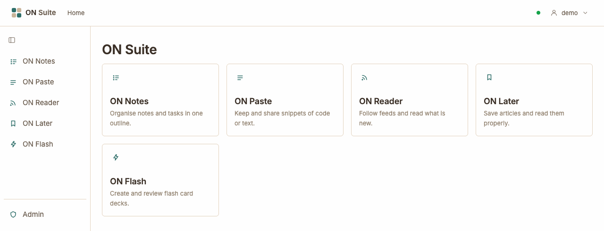
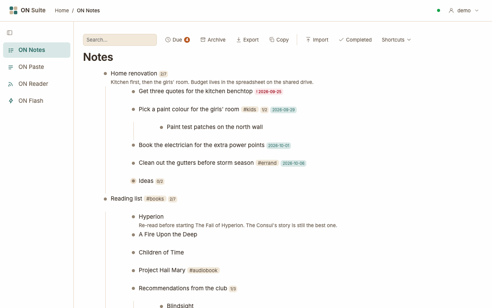
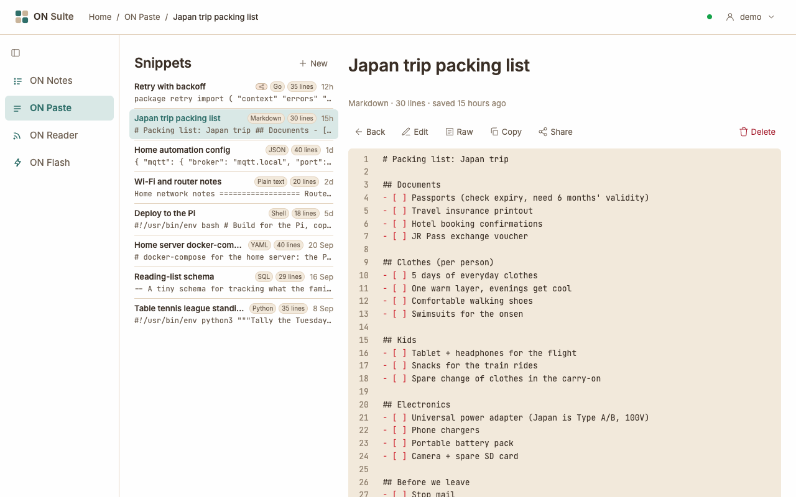
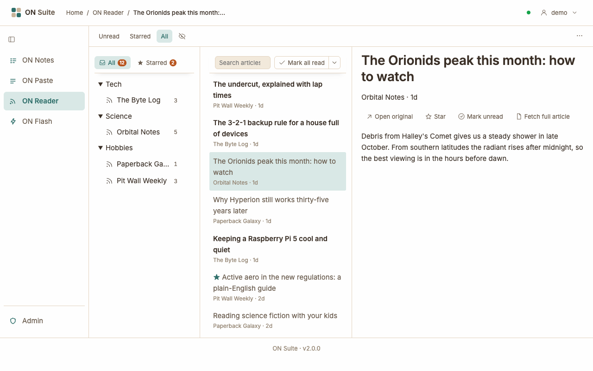
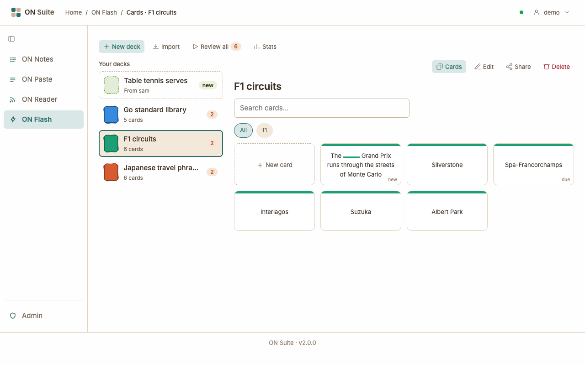

# ON Suite

A small, self-hosted set of everyday apps for you and the people you trust —
one binary, one SQLite file.

<p align="center">
  <picture>
    <source media="(prefers-color-scheme: dark)" srcset="docs/images/hero-dark.png">
    
  </picture>
</p>

## Why ON Suite

ON Suite is a handful of small apps — notes, snippets, news feeds and flash
cards — that a household shares from one private website. It is built for a
household, not a company: the author plus a few family and friends. Accounts
are invite-only, there is no public sign-up, and everything you make stays
private unless you choose to share it.

Most self-hosted app suites are either a pile of Docker Compose services,
each with its own database, or a SaaS product wearing a self-host badge. ON
Suite is neither. It is one Go binary and one data directory, with nothing
else to run: no database server, no containers to wire together. It runs the
same way on a Raspberry Pi as it does on a laptop, and copying that one
directory is a complete backup.

If you're looking for a SaaS-scale platform, with thousands of users and
multi-tenant hardening, this isn't it. It's the opposite bet, optimised for
"one binary, one data directory, nothing else to run."

## The apps

Sign in once and move freely between four apps.

### ON Notes

All your notes and to-do lists in one outline, where any bullet can have
bullets of its own. Tick things off, give them due dates, search everything,
and share any part of the outline with a link.
[Read the ON Notes guide →](docs/user/notes.md)

### ON Paste

A place for bits of text you want to find again — a packing list, the Wi-Fi
settings, a config file or a piece of code, with colour highlighting. Share
any snippet with a link. [Read the ON Paste guide →](docs/user/paste.md)

<p align="center">
  <picture>
    <source media="(prefers-color-scheme: dark)" srcset="docs/images/app-notes-dark.png">
    
  </picture>
  <picture>
    <source media="(prefers-color-scheme: dark)" srcset="docs/images/app-paste-dark.png">
    
  </picture>
</p>

### ON Reader

The newest articles from your favourite websites in one place, so you don't
have to visit each site to see what's new. Sort feeds into folders, star
what you want to keep and fetch the full article when a feed only sends a
summary. [Read the ON Reader guide →](docs/user/reader.md)

### ON Flash

Flash cards for learning things by heart — words for a trip, times tables,
race circuits. ON Flash shows you a few cards each day: the hard ones come
back often, the easy ones less and less. You can give a copy of a deck to
someone else in your household. [Read the ON Flash guide →](docs/user/flash.md)

<p align="center">
  <picture>
    <source media="(prefers-color-scheme: dark)" srcset="docs/images/app-reader-dark.png">
    
  </picture>
  <picture>
    <source media="(prefers-color-scheme: dark)" srcset="docs/images/app-flash-dark.png">
    
  </picture>
</p>

## Run it

With Docker, start the server and create the first account (it asks for a
password):

```bash
docker run -d --name onsuite -p 8080:8080 -v onsuite-data:/data ghcr.io/iliafrenkel/on-suite:latest
docker exec -it onsuite /onsuite user add ilia --admin --data-dir /data
```

Then open <http://localhost:8080/> and sign in. You can invite everyone else
from **Admin → Manage users**.

Rather not use Docker? Every [release](https://github.com/iliafrenkel/on-suite/releases)
has a ready-built binary for Linux (including Raspberry Pi), macOS and
Windows. For a real server — systemd, TLS, backups and upgrades — follow the
[self-hosting guide](docs/self-hosting/deploying.md).

## Documentation

| Guide | What's in it |
|---|---|
| [User guides](docs/user/index.md) | Using each app |
| [Self-hosting](docs/self-hosting/deploying.md) | Installing, TLS, backups, upgrades, Docker |
| [Developers](docs/developers/index.md) | Building, architecture, adding an app, testing, releasing |
| [Contributing](CONTRIBUTING.md) | Ground rules for issues and pull requests |

## License

MIT — see [LICENSE](LICENSE).
