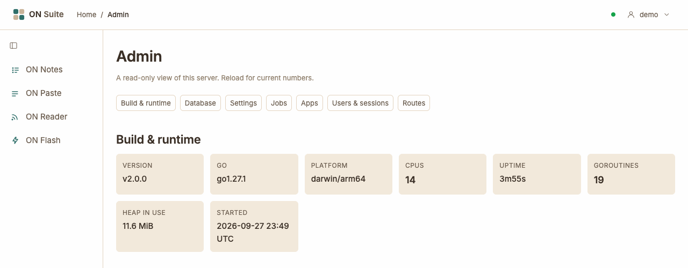
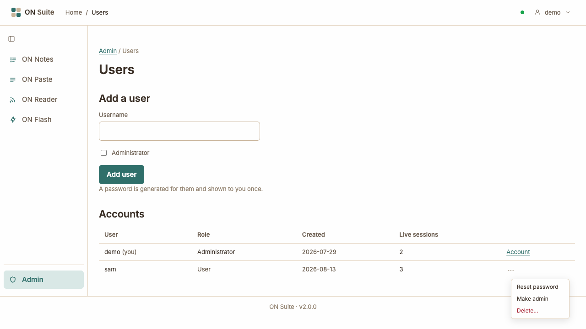
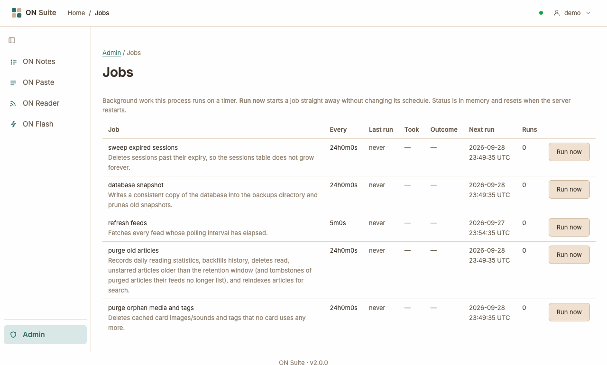

# Administration

This guide is for the person who runs ON Suite for the household: the
admin. It covers the admin page, adding and removing people, the jobs ON
Suite runs in the background, and the few tasks you do on the server
itself. Everything here is for admins only; other people don't see these
pages.

## Quick tour

Click **Admin** at the bottom of the sidebar to open the admin page.



- **The section buttons** under the title jump to each part of the page:
  **Build & runtime**, **Database**, **Settings**, **Jobs**, **Apps**,
  **Users & sessions** and **Routes**.
- **The boxes** in each section show one fact each, such as the
  **Version** or the **Uptime**.
- **Manage jobs →** at the end of **Jobs** and **Manage users →** at the
  end of **Users & sessions** open the pages where you make changes.

The admin page itself only shows information: nothing on it changes
anything. The numbers are counted when the page opens, so reload it to see
current ones.

## Who is an admin

An admin is anyone whose role is **Administrator**. Everyone else is a
**User**. You can see your own role on your **Account** page. Only admins
see **Admin** in the sidebar and can open the admin pages.

The first admin is created on the server when ON Suite is installed (see
[Adding an account from the server](#adding-an-account-from-the-server)).
After that, any admin can make someone else an admin from the **Users**
page (see [Making someone an admin](#making-someone-an-admin)).

There's always at least one admin: you can't remove your own admin role or
delete your own account.

## What the admin page shows

- **Build & runtime** — the **Version** of ON Suite, how long it has been
  running (**Uptime**) and when it **Started**, plus technical details
  about the computer it runs on. The **Version** is the same one shown in
  the footer.
- **Database** — how big the database file is (**File**), a few more
  technical sizes, where the file lives on the server, and a list of the
  database updates ON Suite has applied over time.
- **Settings** — every setting ON Suite is running with. The **Source**
  column says where each value came from: **flag** (typed on the command
  that starts ON Suite), **environment** (set in the server's
  environment), **default** (you didn't set it) or **derived** (worked
  out from another setting, such as TLS). **What it does** explains each
  one.
- **Jobs** — a summary of the background jobs (see
  [Background jobs](#background-jobs)).
- **Apps** — numbers from each app (see
  [What the app numbers mean](#what-the-app-numbers-mean)).
- **Users & sessions** — how many **Accounts** there are and how many
  **Live sessions**. A session is one browser where someone is signed in,
  so one person on a laptop and a phone has two. **Expired, not swept**
  counts old sessions that have run out but haven't been cleared away yet;
  the **sweep expired sessions** job removes them. The table lists each
  account with its role, the date it was created and its live sessions.
- **Routes** — every web address ON Suite answers, and whether each one
  is **public** (anyone can open it, such as the sign-in page and shared
  links) or needs someone **signed in**.

### What the app numbers mean

The numbers in **Apps** count everyone's data together, not just yours.
Each app shows its own set; ON Flash doesn't report any, so it doesn't
appear.

- **ON Notes** — **Bullets** (all bullets), **Done**, **Overdue** (due,
  not done and not archived), **Archived**, **Shared** (bullets anyone
  with the link can read) and **Newest bullet** (when the latest one was
  added).
- **ON Paste** — **Snippets**, **Shared**, **Total size** (the text of
  all snippets together), **Largest** (the biggest snippet) and
  **Newest**.
- **ON Reader** — **Feeds** (each website address counted once, however
  many people follow it), **Subscriptions** (each person following a feed
  counts once), **Articles**, **Cached images** and **Last poll** (how
  long ago a feed was last checked). **Failing feeds** appears only when a
  feed keeps failing to load; ON Reader then tries it less often.

## Managing users

Click **Manage users →** on the admin page to open the **Users** page.



The **Accounts** table lists everyone, with their **Role**, the date their
account was **Created** and their **Live sessions**. Click **···** at the
end of a row for that person's menu. Your own row, marked **(you)**, has an
**Account** link instead: you change your own password there.

### Adding someone

1. Type a **Username** under **Add a user**. Usernames are 3 to 32
   letters, digits, dots, dashes or underscores, and start and end with a
   letter or digit.
2. Tick **Administrator** if they should be an admin too.
3. Click **Add user**.

ON Suite makes up a password for them and shows it at the top of the page,
such as **Password for sasha:** followed by the password. Click **Copy**
and pass it on to them. As the page says, **This is the only time it is
shown.** Once you leave the page, nobody can see it again. Ask them to
change it to one of their own on their **Account** page.

If the username is already in use, you see **The username "sasha" is
already taken.** Choose another.

### Resetting a password

If someone forgets their password, click **···** in their row and choose
**Reset password**. ON Suite makes up a new password and shows it once,
just like when you add someone. Pass it on, and ask them to change it on
their **Account** page.

Resetting signs them out everywhere straight away, so whoever had the old
password can't carry on using it.

You can't reset your own password here. Use your **Account** page, or, if
you can't get in at all, reset it on the server (see
[Resetting a password from the server](#resetting-a-password-from-the-server)).

### Making someone an admin

Click **···** in their row and choose **Make admin**. To take it away
again, choose **Remove admin**. The change applies as soon as they open
their next page.

### Deleting an account

1. Click **···** in their row and choose **Delete…**.
2. ON Suite asks **Permanently delete sam and everything they own in
   every app? This cannot be undone.**
3. Click **Delete sam** to go ahead, or **Cancel** to go back.

Deleting an account removes everything that person made, in every app:

- their notes, including any they had shared;
- their snippets, including any they had shared;
- the feeds they followed, their folders, what they had read or starred,
  and their reading stats (feeds other people also follow keep working
  for them);
- their decks, cards, tags and study history, and any deck they had
  offered to someone that hasn't been added yet (a copy someone already
  added to their own decks stays with them);
- all the places they're signed in.

Their shared links stop working straight away. Their data still exists in
any backups taken before you deleted them.

## Background jobs

ON Suite does some work on its own, on a timer: checking feeds, tidying up
and taking backups. Click **Manage jobs →** on the admin page to see these
jobs on the **Jobs** page.



Each row shows:

- **Job** — its name and what it does.
- **Every** — how often it runs, such as **24h0m0s** (once a day) or
  **5m0s** (every five minutes).
- **Last run**, **Took** and **Outcome** — when it last ran, how long it
  took, and **ok** or **failed** with the reason. **(manual)** after the
  time means someone clicked **Run now**.
- **Next run** — when it will run next.
- **Runs** — how many times it has run.

After ON Suite starts, each job waits one full interval before its first
run, so a daily job first runs a day later. The history on this page
starts again from **never** whenever ON Suite restarts.

The jobs are:

- **sweep expired sessions** — clears away sign-ins that have run out.
- **database snapshot** — saves a copy of the whole database to the
  backups folder on the server, keeping the newest 7 unless the server is
  set up to keep a different number.
- **refresh feeds** — checks each ON Reader feed that's due for a check.
  Each feed is checked about every half hour; this job just looks for the
  ones whose turn has come.
- **purge old articles** — once a day, records ON Reader's reading
  stats, deletes read, unstarred articles published more than 60 days
  ago along with any cached images no article uses any more, and keeps
  ON Reader's search up to date.
- **purge orphan media and tags** — once a day, deletes ON Flash pictures,
  sounds and tags that no card uses any more.

### Running a job now

Click **Run now** next to a job to start it straight away, for example
**database snapshot** before you upgrade ON Suite. The job shows
**running** until it finishes, and the page updates by itself. Running a
job by hand doesn't change its **Next run**.

**Run now** is disabled while its job is already running. If someone else
starts it just before you, or your page is simply out of date, clicking it
anyway shows a message such as **database snapshot is already running.**

Running **refresh feeds** does the same as **Refresh all feeds** in ON
Reader: it checks only the feeds that are due. To check one particular
feed straight away, use **Refresh feed** in that feed's menu in ON Reader.

### Why a job says disabled

**disabled** in the **Every** column means the job has no timer, so its
**Next run** is empty. This happens to **sweep expired sessions** and
**database snapshot** when the server is set up to take backups some other
way. You can still click **Run now** on a disabled job.

A job that doesn't appear at all belongs to an app that is turned off on
this server.

## Command-line tasks

A few tasks are done on the server itself, in a terminal. Each command
below needs the same data folder ON Suite uses, given with `--data-dir`
(for example `--data-dir /var/lib/onsuite`). The
[self-hosting guide](https://github.com/iliafrenkel/on-suite/blob/main/docs/self-hosting/deploying.md)
has the details.

### Adding an account from the server

```
onsuite user add ilia --admin --data-dir /var/lib/onsuite
```

This is how you create the first admin, before anyone can use the
**Users** page. It asks you to type a password twice; it needs at least 12
characters. Leave out `--admin` for an ordinary account. See
[Adding people](https://github.com/iliafrenkel/on-suite/blob/main/docs/self-hosting/deploying.md#adding-people).

### Resetting a password from the server

```
onsuite user reset-password ilia --data-dir /var/lib/onsuite
```

Use this when someone can't get in and there's no other admin to help, even
if it's you. It asks for the new password twice and signs that person out
everywhere. It works while ON Suite is running.

### Taking a backup

```
onsuite backup --data-dir /var/lib/onsuite
```

This saves a copy of the whole database into the backups folder, just like
the **database snapshot** job — but without `--keep`, it keeps every
snapshot forever, unlike the job's own default of keeping only 7. Add
`--keep 30` to keep only the newest 30 copies, or `--out` and a file name
to save the copy somewhere else. It's safe to run while ON Suite is
running. The self-hosting guide explains
[backups and restoring](https://github.com/iliafrenkel/on-suite/blob/main/docs/self-hosting/deploying.md#backups).

### Exporting someone's data

```
onsuite export sam --data-dir /var/lib/onsuite --out sam.json
```

This writes one person's ON Notes, ON Paste and ON Reader data into a
single file you can give them. It doesn't include ON Flash decks yet.
Shared ON Notes bullets keep their share link in the file, so treat the
file as private; ON Paste's share links aren't included. See
[Exporting your data](https://github.com/iliafrenkel/on-suite/blob/main/docs/self-hosting/deploying.md#exporting-your-data).

Back to [all guides](index.md).
