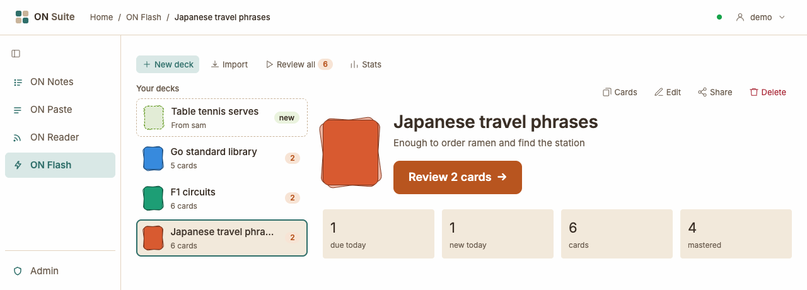
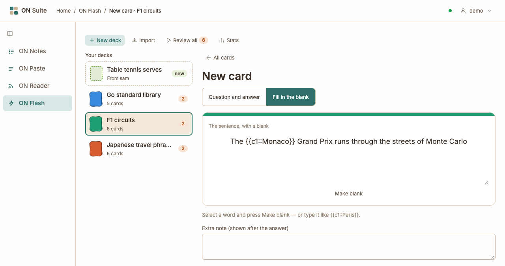
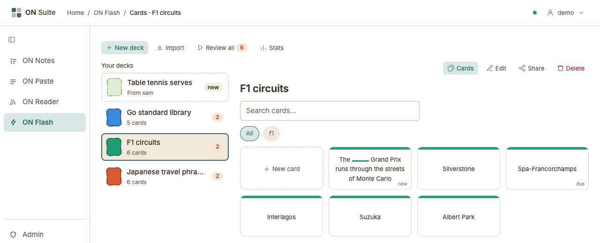
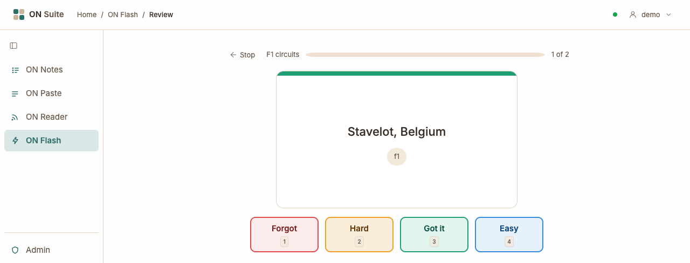
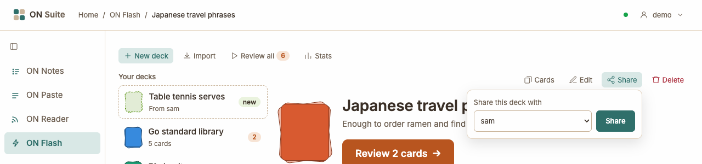
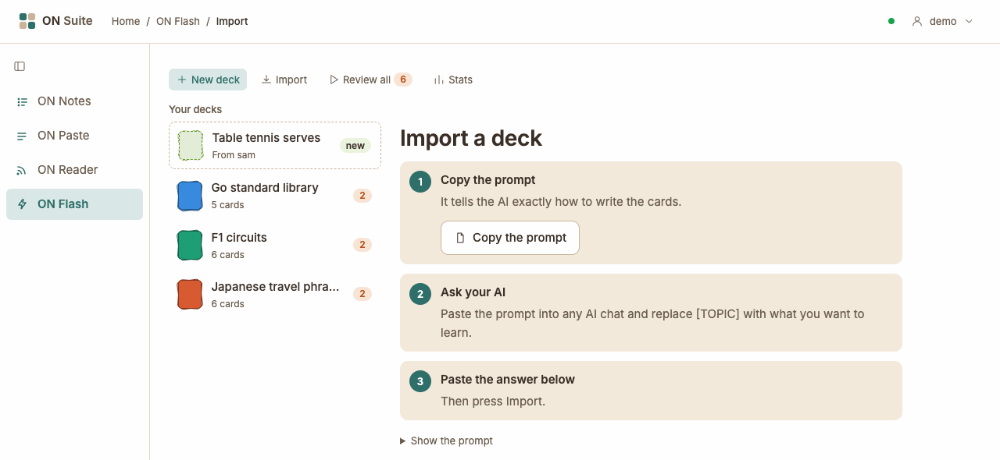
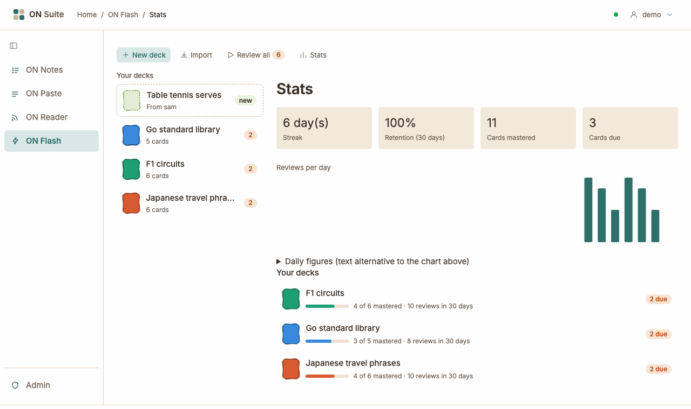

# ON Flash

ON Flash helps you learn things and remember them: words for a trip,
spellings, times tables, capital cities, or anything else you want to know
by heart. You make a deck of flash cards, each with a question on the front
and the answer on the back, and ON Flash shows you a few cards each day.
The cards you find hard come back often; the ones you know well come back
less and less. Your decks are private to you, but you can give a copy of a
deck to someone else in your household.

## Quick tour



- **The toolbar** along the top:
  - **New deck** — make a deck (see [Making a deck](#making-a-deck)).
  - **Import** — make a deck from cards written by an AI chat, or by hand
    (see [Importing cards](#importing-cards)).
  - **Review all** — study the cards waiting in all your decks at once. The
    number counts them.
  - **Stats** — how your studying is going (see [Your stats](#your-stats)).
- **Your decks** on the left. Under each deck's name is its number of
  cards, or **all done** when there's nothing left to study today,
  **no cards yet** or **taking a break**. The small number on the right
  counts the cards waiting for you in that deck.
- **A deck someone gave you** sits at the top of the list with a dashed
  border, **From** and their name, and a **new** label (see
  [Sharing a deck](#sharing-a-deck)).
- **The open deck** on the right. Click a deck on the left to see it here:
  - its name and description;
  - the big button to study it, such as **Review 2 cards**;
  - four boxes: cards **due today** (cards you've seen before that are due
    again), **new today** (new cards you'll see today), all its **cards**,
    and how many are **mastered** (cards you know well enough that they now
    come back days or more apart);
  - the buttons above it: **Cards**, **Edit**, **Share** and **Delete**.

When a deck has nothing waiting, it says **All done for today** and when
the next cards come, such as **Next cards tomorrow** or **More cards later
today**.

On a phone there isn't room for both sides, so you see your decks first.
Tap a deck to open it, and tap **Decks** to go back to the list.

## How ON Flash helps you remember

ON Flash uses spaced repetition. Each time you see a card, you tell ON
Flash how well you remembered it. A card you forgot comes back in a few
minutes. A card you remembered waits a little longer each time: a few
minutes, then a couple of days, then a week or two, then months. So you
spend your time on the cards you find hard, and you still see the easy ones
now and then, just before you'd forget them. ON Flash works out the waits
with a well-known method called FSRS; you don't need to do anything except
answer honestly.

The best way to use it is a little every day. Open ON Flash, click
**Review all**, and work through what's waiting.

## Making a deck

A deck is a pile of cards about one topic, such as "Spanish for our trip".

1. Click **New deck** in the toolbar.
2. Type a **Name**. Each of your decks needs a different name.
3. If you like, write a line in **What's it about? (optional)**.
4. Pick a **Colour** by clicking one of the coloured squares. The deck and
   its cards are drawn in that colour.
5. Click **Create deck**.

Your new deck opens, saying **This deck has no cards yet**. Click **Add
cards** to write the first one.

If you haven't made any decks yet, ON Flash shows **Make your first deck**
with two buttons: **Create a deck** and **Import a deck**.

## Adding cards

Open a deck, click **Cards**, then click **New card** (the first tile in the
grid).



First choose the kind of card at the top:

- **Question and answer** — type the question in **Front: the question**
  and the answer in **Back: the answer**.
- **Fill in the blank** — type a sentence in **The sentence, with a blank**
  and mark the words to hide. There's no separate answer: the hidden words
  are the answer.

Then, if you like:

- **Extra note (shown after the answer)** — a hint, an example or a fun
  fact, shown under the answer.
- **Tags** — words that group cards, such as `verbs` or `europe`. Type a
  tag and press `Enter` or type a comma to add it. Click the **×** on a tag
  to remove it, or press `Backspace` in the empty box to remove the last
  one. Tags are always saved in small letters.
- **A picture** — drag a picture onto **Drop a picture here, or click to
  choose one**, or click it to pick one from your device. It can be up to
  5 MB and shows under the question.
- **A sound** — the same for a sound file, up to 10 MB, in **Drop a sound
  here, or click to choose one**. A player appears on the card once you
  turn it over, handy for how a word is said.

Click **Save card** to save it and see it. To write several cards in a row,
click **Save and add another** instead: you see **Card saved. Add the next
one.** and an empty form that keeps the kind of card and the tags you just
used. Click **Cancel** or **All cards** to go back without saving.

### Making blanks

To hide a word in a **Fill in the blank** card, select it with the mouse
and click **Make blank**. ON Flash wraps it in a marker such as
`{{c1::Paris}}`. You can also type the markers yourself:

| You type | The question shows | The answer shows |
|----------|--------------------|------------------|
| `{{c1::Paris}} is in France` | a blank, then "is in France" | **Paris** is in France |
| `{{c1::Paris::a city}} is in France` | a blank with the hint "a city" | **Paris** is in France |
| `{{c1::Rome}} and {{c2::Paris}}` | two blanks | both words filled in |

All the blanks in a card are hidden together, so each card asks for every
hidden word at once.

If something's missing, a message appears above the form, such as **The
card needs a front**, **A basic card needs a back** or **A cloze card's
front needs at least one {{...}} deletion** (a fill-in-the-blank card
without a blank).

## Browsing your cards

Open a deck and click **Cards** to see all its cards as small tiles, showing
the question side.



- A tile marked **new** is a card you haven't studied yet, and **due**
  means it's waiting for you to review it.
- **Search cards…** narrows the tiles down as you type. It looks at the
  front, the back and the note.
- **The tag buttons** show only the cards with that tag. Click **All** to
  see every card again. While a tag is picked, **Show “f1” in all decks**
  (with your tag's name) shows that tag's cards from all your decks (see
  [Tags across decks](#tags-across-decks)).
- If nothing matches, you see **No cards match.** Click **Clear filters** to
  see everything again.

### Looking at one card

Click a tile to open the card. Click the card, or press `Space`, to turn it
over and see the answer; click it again to turn it back. The arrows either
side (or `←` and `→`) move to the previous and next card.

- **Edit card** — change the card. The form is the same as for a new one.
  To take a picture or sound off, tick **Remove the picture** or **Remove
  the sound**, then click **Save card**. Changing a card doesn't reset what
  ON Flash has learned about how well you know it. **Back to the card**
  leaves without saving.
- **Delete card** — ON Suite asks **Delete this card? This can't be
  undone.** Click **OK** to delete it.
- **All cards** — back to the grid.

## Reviewing cards

Reviewing is how you study. To start:

- click **Review all** in the toolbar to go through every deck; or
- open a deck and click its **Review** button, such as **Review 2 cards**,
  for just that deck.



1. Read the question and try to remember the answer. A card you haven't
   seen before has a small **new** in its corner.
2. Click the card, click **Show answer**, or press `Space`, to turn it
   over.
3. Be honest with yourself and click how well you remembered:
   **Forgot**, **Hard**, **Got it** or **Easy** (or press `1` to `4`).

The next card appears straight away. The bar at the top shows how far
you've got today, and a count such as **1 of 2** says where you are.

Made a mistake? Click **Undo last** (or press `U`) to take back the grade
you just gave. The card comes back as if you hadn't answered it. Undo only
goes back one card.

Click **Stop** at any time to leave; you can carry on later from where you
were. When you've finished, you see **Nice work!** with how many cards you
reviewed today, how they went (such as **9 got it · 2 hard**) and, after
two or more days in a row, your streak, such as **🔥 3 days in a row**.
Another deck with cards waiting is offered next, such as **Review F1
circuits next (2 due)**; otherwise click **Back to decks**. If there's
nothing to study at all, you see **Nothing to review right now**.

### What the four buttons do

Each button decides when the card comes back:

- **Forgot** — you didn't remember it. The card comes back in a few minutes
  (about one minute for a new card, ten for one you'd learned), and it waits
  less long after that until you know it again.
- **Hard** — you remembered, but only just. It comes back sooner than
  **Got it** would bring it.
- **Got it** — you remembered. The wait grows each time: a new card comes
  back after about ten minutes, then two days, then about eleven days, then
  more than a month, and so on.
- **Easy** — that was too easy. The card waits longer than **Got it**; a new
  card jumps straight to about a week.

A card that comes back in a few minutes shows up again in the same review
once its time is up. If you finish before then, the deck says **More cards
later today**: come back a little later to see it.

## Changing a deck's settings

Open the deck and click **Edit**. You can change its **Name**, **What's it
about? (optional)** and **Colour**, and two daily limits:

- **New cards per day** — how many cards you've never seen that the deck
  shows each day. It starts at 20. Lower it if a big deck feels like too
  much at once.
- **Reviews per day (blank for no limit)** — how many cards you've seen
  before that the deck shows each day. Leave it empty to see every card
  that's due.

Click **Save** to keep your changes, or **Cancel** to leave them. When a
deck has reached its limit for the day, it says **Next cards tomorrow**.

### Taking a break

Going on holiday? Under **Take a break** on the same page, click **1 week**
or **1 month**. The deck then sits out of your reviews, including **Review
all**, until then. Nothing is lost: cards that fall due in the meantime are
waiting when you come back.

While it's on a break, the deck shows **taking a break** in the list and
**Taking a break until 4 Oct.** (with its own date) when you open it. Click
**End break** to bring it back early.

### Deleting a deck

Open the deck and click **Delete**. ON Suite asks you to confirm, for
example **Delete “F1 circuits” and all its cards? This can't be undone.**
Click **OK** to delete the deck and every card in it.

## Tags across decks

Tags help you find cards about one thing, even when they're in different
decks. To see every card with a tag:

- open a card and click one of its tags under it; or
- in a deck's cards, click a tag button, then **Show “…” in all decks**.

You see **Cards tagged** with the tag, and every card that has it, with its
deck's name. Click a card to open it in its deck. Click **Decks** to go back.

## Sharing a deck

You can give a copy of one of your decks to someone else in your household.



1. Open the deck and click **Share**.
2. Under **Share this deck with**, choose the person.
3. Click **Share**.

The person appears in the Share box with how it's going: **waiting** until
they answer, then **added** or **said no thanks**. While it says
**waiting**, you can click **Revoke** to take the offer back.

They get their own copy of the deck, with all its cards, tags, pictures
and sounds as they are when they accept it. After that the two decks are
separate: changes either of you makes don't reach the other one. They start
fresh, so how well you know the cards isn't shared.

If you add more cards later, share the deck with them again. This time they
get just the new cards, added to the copy they already have; everything
they've learned stays as it is.

The **Share** button only appears when there's someone else in your ON
Suite to share with.

### When someone shares a deck with you

The deck appears at the top of your list with **From** and their name.
Click it to see its name, description, how many cards it has and **A few of
the cards**. Then:

- **Add to my decks** — add your own copy. It opens straight away with **“…”
  is now in your decks.** If you already have a deck with the same name,
  the copy gets their name after it, such as "Spanish (from sam)".
- **No thanks** — turn it down. It disappears from your list. They can
  share it again later if you change your mind.

When someone shares a deck again that you already have, the list shows a
number such as **+3** instead of **new**, and the deck says how many new
cards they added. Click **Add the new cards** to add just those. If you
already have every card, it says so; click **Got it** to clear it from the
list.

## Importing cards

Writing lots of cards takes time. **Import** makes a whole new deck in one
go from cards written by an AI chat, or by hand.



ON Flash doesn't have a way to export your decks yet.

### With an AI chat

ON Flash has a ready-made prompt: a message that tells an AI exactly how to
write the cards so that ON Flash can read them. It asks for about 20 short
cards, written for a student aged about 9 to 14 unless you say otherwise.

1. Click **Import** in the toolbar.
2. Click **Copy the prompt**. The button says **Copied!**. (If your browser
   can't copy it for you, the button says **Press Ctrl+C to copy** with the
   prompt selected; on a Mac, press `Cmd`+`C`.) To read the prompt first,
   click **Show the prompt**.
3. Paste it into any AI chat and replace `[TOPIC]` with what you want to
   learn, such as "the planets" or "30 French animal words".
4. Copy the AI's whole answer and paste it into **The AI's answer**.
5. Click **Import**.

The new deck opens with a message such as **Imported 20 cards into
“Planets”.** Check a few cards: an AI can get things wrong. You can fix any
card with **Edit card**.

### Writing it by hand

You can write the cards yourself in a simple format instead. Click
**Writing it by hand?** to see the format in the app. Here's an example:

```text
# Planets
The planets of our solar system

## Card
Front: Which planet is closest to the Sun?
Back: Mercury
Tags: planets, space
Notes: It takes just 88 days to go round the Sun.

## Card
Type: cloze
Front: {{c1::Jupiter}} is the biggest planet.
```

- The first line, starting with `#`, is the deck's name. Any lines after it,
  before the first card, become its description.
- Each card starts with a `## Card` line.
- `Front:` and `Back:` are the question and answer. For a fill-in-the-blank
  card, add `Type: cloze` and leave out `Back:`.
- `Tags:`, `Notes:`, `Image:` and `Audio:` are optional. `Image:` and
  `Audio:` take a web address that leads straight to a picture or sound
  file.

ON Flash usually works out which format you've pasted. If it guesses
wrong, open **Choose format (usually not needed)** and pick **JSON** (what
the AI prompt asks for) or **Markdown** (the hand-written format).

Pictures and sounds from web addresses are downloaded the first time the
card is shown, and ON Flash keeps its own copy after that. If an address
doesn't work, the card appears without it; you can add one yourself with
**Edit card**.

### If the import doesn't work

A message appears above the form and what you pasted stays there, so you
can fix it. For example:

- **You already have a deck named "Planets"** — rename one of them, or
  change the name in what you pasted. Importing always makes a new deck; it
  can't add cards to one you already have.
- **The import needs a '# Deck Name' heading on the first line** — ON Flash
  read it as the hand-written format and the first line isn't a `#` name.
  If you pasted an AI's answer, it must start with `{`: delete any words
  or ```` ``` ```` marks the AI put before it (and after it).
- A message starting with **Invalid JSON** — the AI's answer is cut short
  or muddled. Copy it again, or ask the AI to try again.
- A message starting with **Card 3:** — something is wrong with that card,
  such as a question and answer card without a back.

## Your stats

Click **Stats** in the toolbar to see how your studying is going.



- **Streak** — how many days in a row you've reviewed at least one card.
  Today counts as soon as you review something; a day with no reviews at
  all starts the streak again.
- **Retention (30 days)** — out of all your reviews in the last 30 days,
  how many weren't **Forgot**.
- **Cards mastered** — cards you know well enough that they come back days
  or more apart, across all your decks.
- **Cards due** — cards you've seen before that are waiting to be reviewed
  now, in all your decks except those taking a break. New cards and daily
  limits don't count here, so it can differ from the numbers in your deck
  list.
- **Reviews per day** — one bar for each of the last 30 days. Point at a
  bar to see its date and number. **Daily figures (text alternative to the
  chart above)** shows the same numbers as a table.
- **Your decks** — each deck with a bar showing how much of it is mastered
  (such as **4 of 6 mastered**), its reviews in the last 30 days, and how
  many cards are waiting (or **all done**). Click a deck to open it.

## Keyboard shortcuts

These work when you're not typing in a box. The review screen shows its
keys on the buttons, and a card's page lists its keys under the card.

| Key | What it does |
|-----|--------------|
| `Space` | Review: turn the card over to show the answer. Card page: turn the card over |
| `1` | Review: grade the card **Forgot** (once the answer is showing) |
| `2` | Review: grade the card **Hard** (once the answer is showing) |
| `3` | Review: grade the card **Got it** (once the answer is showing) |
| `4` | Review: grade the card **Easy** (once the answer is showing) |
| `U` | Review: undo the last grade |
| `Esc` | Review: stop reviewing |
| `←` / `→` | Card page: previous or next card |
| `E` | Card page: edit the card |
| `Enter` or `,` | In **Tags**: add the tag you've typed |
| `Backspace` | In an empty **Tags** box: remove the last tag |

The number keys do nothing until the answer is showing, so you can't grade
a card by accident before you've seen it.

Back to [all guides](index.md).
