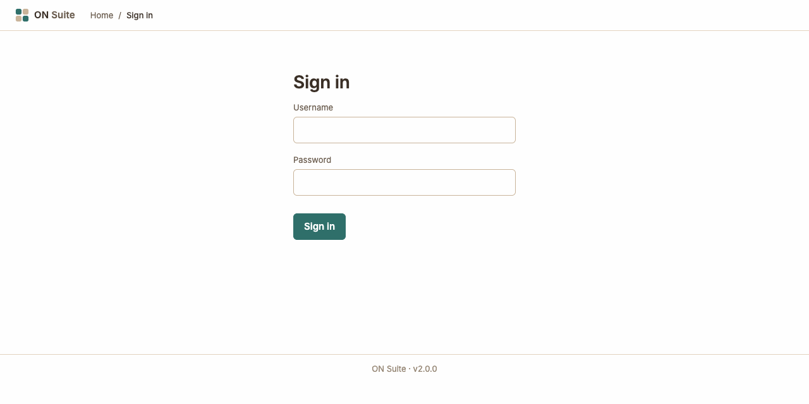
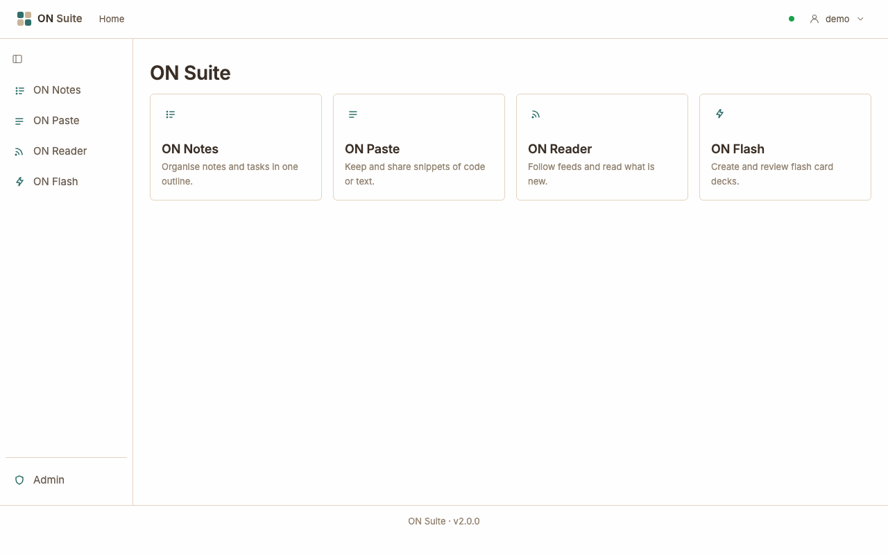
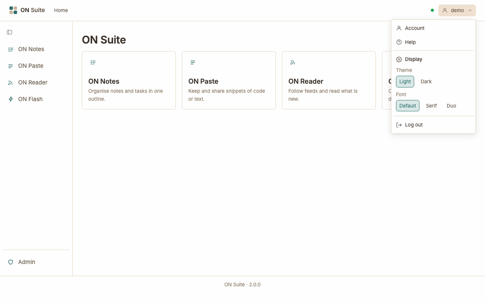
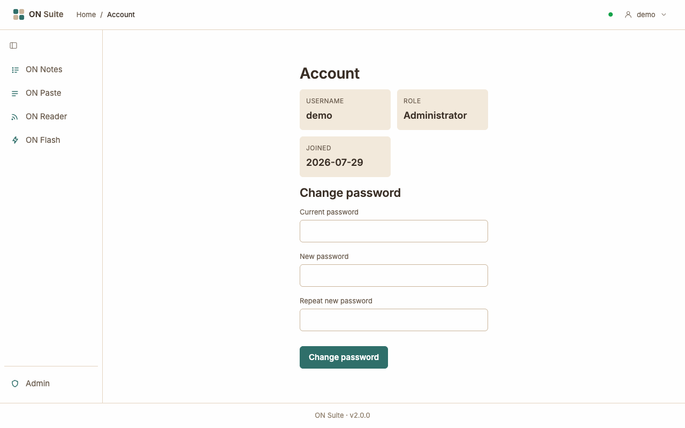

# Welcome to ON Suite

ON Suite is a small set of everyday apps that you and your household share
from one private website. Everything you create is yours: other people
can't see it in ON Suite unless you choose to share it.

## What ON Suite is

ON Suite is one place for your notes, snippets, news feeds and study cards.
You sign in once and move freely between four apps:

- **ON Notes** — organise notes and to-do lists in one outline.
- **ON Paste** — keep and share snippets of text or code.
- **ON Reader** — follow your favourite websites and read what's new.
- **ON Flash** — make flash card decks and study them.

## Signing in

1. Open your ON Suite address in your web browser.
2. Type your **Username** and **Password**.
3. Click **Sign in**.

There's no way to sign up yourself. The person who runs your ON Suite (the
admin) creates your account and gives you your username and first password.
If you forget your password, ask them to reset it.

If you see **That username or password is incorrect.**, check the spelling
and try again. After too many wrong tries in a row, ON Suite asks you to
**Slow down** — wait about 15 minutes before trying again.

You stay signed in on that browser for 30 days after you last used it, so
you won't need to sign in every time.

## The dashboard

After signing in you land on the dashboard, your home page.

- **The cards** in the middle — one per app. Click a card to open that app.
- **The sidebar** on the left — the same apps, always there wherever you
  are.
- **The top bar** — the ON Suite logo, your current location, and your name
  on the right.
- **The dot** next to your name — green means everything is saving
  normally. If it turns red, you've lost your connection; wait for it to go
  green again before making more changes.
- **The footer** at the bottom shows which version of ON Suite you're using.
  It's handy to mention if you report a problem.

## Moving between apps

- **The sidebar:** click an app's name to go straight to it. The app you're
  in is highlighted.
- **Collapsing the sidebar:** click the small panel button at the top of the
  sidebar to shrink it to icons only and give the page more room. Click it
  again to bring the names back. ON Suite remembers your choice.
- **The breadcrumb:** the trail at the top, such as **Home / ON Notes**,
  shows where you are. When you go deeper into an app, the trail grows;
  click the app's name to step back to its main page. Click **Home** or the
  ON Suite logo to return to the dashboard.

If you're an admin, you also see **Admin** at the bottom of the sidebar.
Other people don't see it.

## The user menu

Click your name in the top right corner to open the user menu.

- **Account** — your account details and password (see
  [Your account](#your-account)).
- **Display** — change how ON Suite looks:
  - **Theme:** **Light** or **Dark**.
  - **Font:** **Default**, **Serif** (a classic book style) or **Duo** (a
    typewriter style).

  Changes apply straight away and are remembered on this browser. On
  another computer or phone, you choose them again.
- **Log out** — sign out of ON Suite on this browser. Do this on a shared
  or borrowed computer.

To close the menu, click anywhere else on the page or press `Esc`.

## Your account

Choose **Account** from the user menu to see your username, your role
(**User** or **Administrator**) and the date you joined.

To change your password:

1. Type your **Current password**.
2. Type your new password in **New password** and again in **Repeat new
   password**. It needs to be at least 12 characters long; a short sentence
   you'll remember works well.
3. Click **Change password**.

You'll see **Password changed. Your other sessions were signed out.** You
stay signed in where you are, but any other computer or phone you were
signed in on will ask for the new password.

## Getting help

These guides explain everything each app can do:

- ON Notes — outlines, tasks, due dates and sharing.
- ON Paste — saving and sharing snippets.
- ON Reader — following feeds and reading articles.
- ON Flash — making decks and studying cards.
- Admin — managing accounts and the server (for admins only).

If something doesn't work the way a guide says, tell the person who runs
your ON Suite, and mention the version number from the footer.
