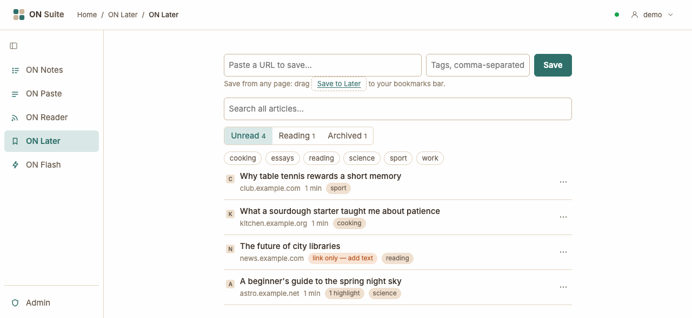
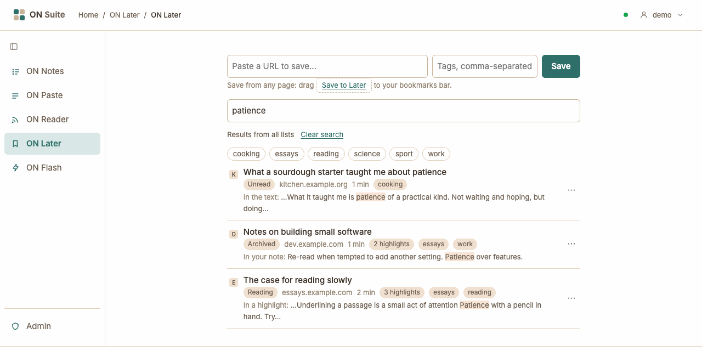
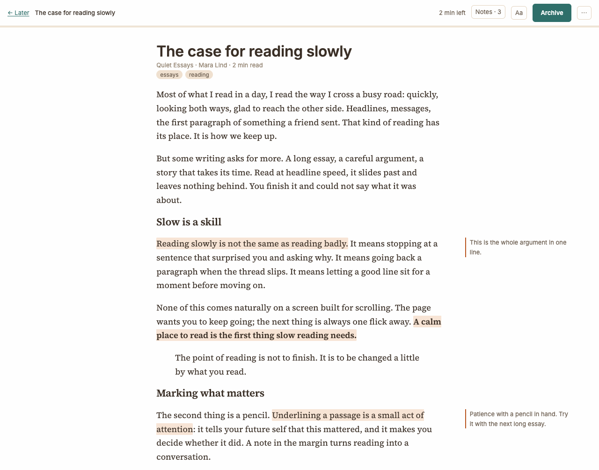
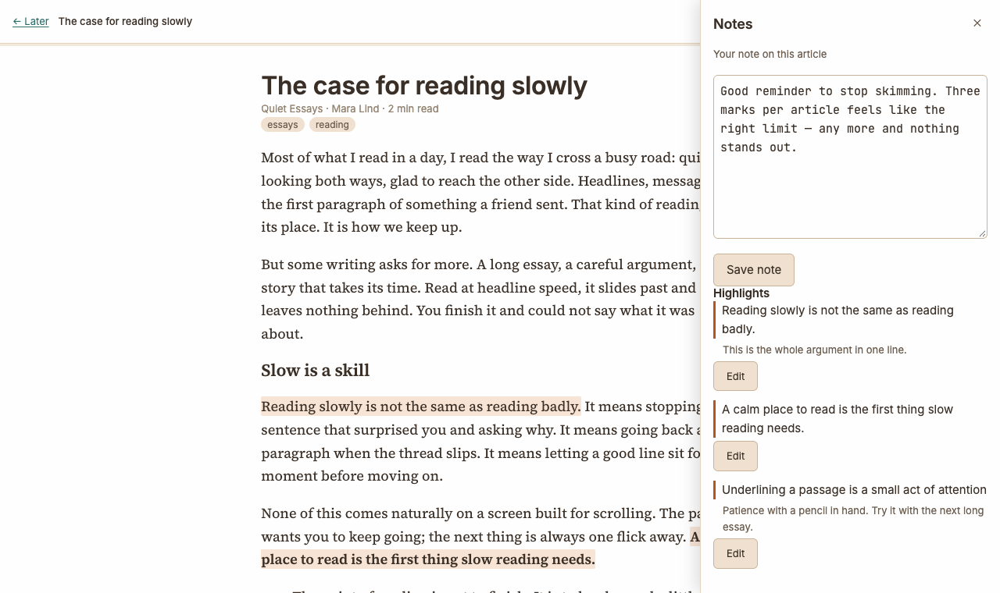

# ON Later

ON Later keeps articles you want to read properly, away from the rush of
your feeds. Save a page, and ON Later keeps a clean copy of it — text and
pictures — so you can read it later, even if the original changes or
disappears.

## Saving an article

1. Copy the address of the page you want to keep.
2. In ON Later, paste it into **Paste a URL to save…** and click **Save**.

The article appears at the top of **Unread**. Click **Open** in the
message, or the article itself, to read it.

Some pages can't be read this way — pages behind a paywall or a sign-in,
for example. ON Later still saves the link and tells you why it couldn't
read the page. Open the original, copy its text, and use **Paste text** to
make it a normal article you can read here.

## Saving from any page

Save without leaving the page you're reading:

1. At the top of ON Later, drag **Save to Later** onto your browser's
   bookmarks bar.
2. On any page, click that bookmark. A small window opens.
3. Click **Save** (or press Enter). The window closes by itself.

You need to be signed in to ON Suite in that browser. If the page is
already in ON Later, the window says so and offers to open it.

## Saving from ON Reader

When you're reading an article in [ON Reader](reader.md), click **Read
later** in its toolbar. The button turns into **Saved to Later ✓**, with a
link to open it. If you'd already saved that page, it says **Already in
Later** instead. The button is there only when ON Later is turned on.

## Finding your articles

Articles are in three lists:

- **Unread** — saved, not opened yet.
- **Reading** — opened at least once.
- **Archived** — finished. Click **Archive** when you're done with an
  article; **Move to unread** brings it back.

## Tags

Tags group articles however suits you — `essays`, `work`, `to cook`.

- **When saving:** type tags, separated by commas, in the **Tags** box
  next to the address, or in the bookmarklet's window.
- **Afterwards:** open an article's **⋯** menu — in the list, or while
  reading — change the **Tags** box and click **Save tags**. Empty the box
  to remove all its tags.

Tags are lowercase, and a tag disappears once no article has it. Click a
tag above the list to see only the articles with it; the counts on
**Unread**, **Reading** and **Archived** follow it. Click the tag again to
see everything. While reading, an article's tags show under its title;
click one to go to its list.

## Searching

Type in **Search all articles…** above the list. Results appear as you
type, from **Unread**, **Reading** and **Archived** together, best match
first. ON Later searches titles, article text, your highlights and their
comments, and your notes. Under each result a line shows where it matched —
*In a highlight*, *In your note* or *In the text* — with the words you
searched for marked.

A selected tag narrows the search too. Click **Clear search**, or empty the
box, to go back to the list you were on.

## Reading an article

An article opens full screen. The top bar has:

- **← Later** — back to the list the article is in.
- **Aa** — choose the font (serif or sans), the text size and the width of
  the column. Changes apply at once and are remembered on every device.
- **Notes** — opens the Notes panel (see below).
- **Archive** — move the article to Archived (or **Move to unread** if it
  is already archived).
- **⋯** — change the article's **Tags**, **Download as Markdown**, **Open
  original** to see the page on its own site, or **Delete** the article.

ON Later remembers where you stopped and opens there next time. The
line under the top bar shows how far through you are, and the bar shows the
minutes left. **Move to unread** starts the article again from the top.

## Highlights and notes

**Notes** in the top bar opens the Notes panel. Write your thoughts on
the whole article in the note at the top; it saves when you click
elsewhere. The same note is at the end of the article, so you can write
it as soon as you finish reading.

Select a passage in the article and a small box appears under it.
Click **Highlight** to mark it, or **Highlight + comment** to add a
comment too. Highlights can't overlap. Every highlight is listed in the
Notes panel; click one to jump to it.

On a wide screen, comments sit in the margin beside their highlights;
click one to edit it. On a narrow screen a 💬 after a highlight means it
has a comment — tap the highlight to read it. The list shows how many
highlights each article has.

Click a highlight (or **Edit** next to it in the Notes panel) to change
its comment or delete it. Deleting a highlight that has a comment asks
first.

## Downloading an article

To keep a copy outside ON Suite, open the article, choose **⋯**, then
**Download as Markdown**. You get a file called `later-article.md` with
the title, the original address, your note, your highlights with their
comments, and then the article itself. Pictures become links to where
they came from. Markdown is plain text, so any text editor opens it, and
note-taking apps such as Obsidian show it formatted.

The admin can also export all your ON Notes, ON Paste, ON Reader, ON Later
and ON Flash data as a single file for you. Ask them if you'd like a
complete copy (the [Admin guide](admin.md#exporting-someones-data)
explains how).

## Deleting an article

Each article in the list has a **⋯** menu to archive, move back to
unread, or delete it without opening it. You can also open the article,
choose **⋯**, then **Delete**. Deleting removes its highlights and note too,
and can't be undone.
