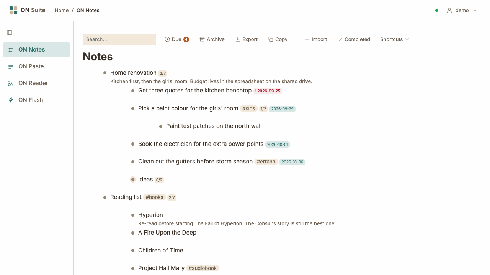
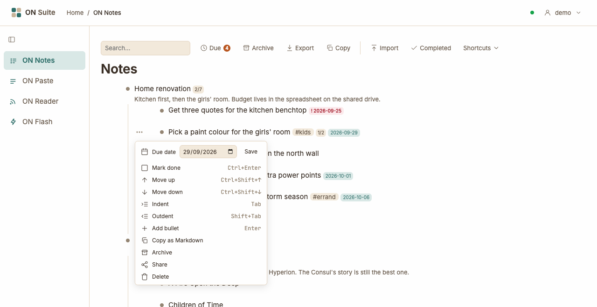
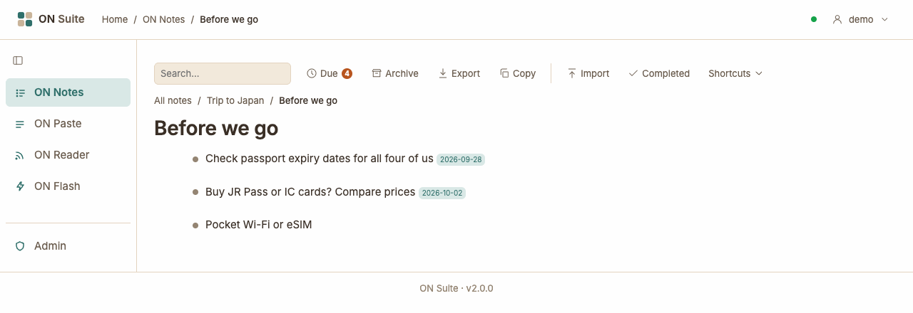
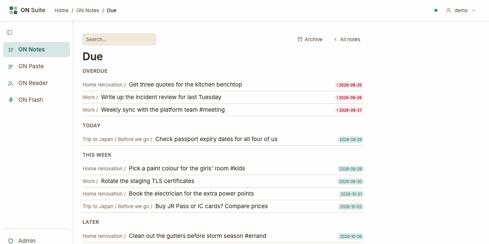
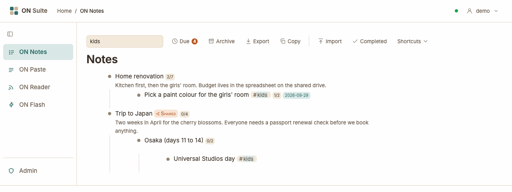
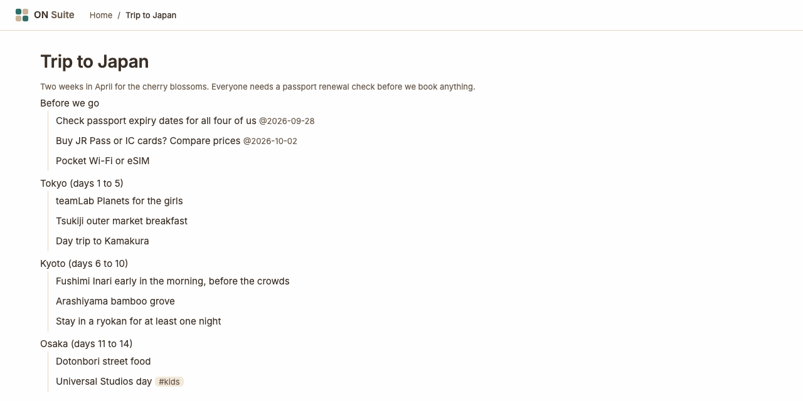

# ON Notes

ON Notes keeps all your notes and to-do lists in one big outline: a list of
bullets, where any bullet can have bullets of its own underneath it. Use it
for shopping lists, holiday plans, a reading list or work tasks, all in one
place. You can tick things off, give them due dates, find anything with a
quick search, and share any part of your outline with a link. Your notes are
private to you unless you share them.

## Quick tour



- **The search box** on the left of the toolbar — type to narrow the outline
  down to matching bullets (see [Searching](#searching)).
- **The toolbar buttons:**
  - **Due** — everything with a due date, in date order. The small number
    counts what's due today or overdue.
  - **Archive** — bullets you've put away.
  - **Export** and **Copy** — take your notes out as text (see
    [Copying and exporting](#copying-and-exporting)).
  - **Import** — bring in an outline from a file.
  - **Completed** — show or hide finished bullets.
  - **Shortcuts** — a reminder of the keyboard shortcuts.
- **The outline** — your bullets. A bullet's own bullets sit indented
  underneath it, joined by a thin line.
- **The dot** in front of each bullet — click it to zoom in on that bullet.
  A dot with a ring around it has bullets hidden underneath it.
- **Small labels** after a bullet's text:
  - a count such as **2/7** — how many of its bullets are ticked off;
  - a date such as **2026-09-29** — its due date. A red date with **!** is
    overdue;
  - a tag such as **#kids**;
  - **Shared** — the bullet has a public link.

Point at a bullet to see more controls on its left: **···**, which opens
the bullet's menu, and, if it has bullets under it, a small arrow that folds
them away. On a touch screen these are always shown.

## Writing notes

### Adding bullets

When your outline is empty, it shows one bullet saying **Start typing…**.
Click it, type your first bullet and press `Enter` to save it. Press
`Enter` again to start the next one.

After that:

- Click any bullet's text to edit it.
- Press `Enter` to add a new, empty bullet after the one you're in (after
  any bullets under it). `Enter` never splits the text you're typing.
- Press `Tab` to move the bullet under the one above it, and `Shift`+`Tab`
  to move it back out (see [Organising your outline](#organising-your-outline)).
- Press `Esc` when you're done editing.

### Adding a note to a bullet

Each bullet can have a note: a smaller, grey line of extra detail under its
text. While you're editing a bullet, an empty line saying **note** appears
under it. Click there, or press `Shift`+`Enter`, and type. A bullet without a
note shows nothing extra.

### Saving

There's no save button: ON Notes saves as you type. The bullet's dot shows
how it's going:

- **orange** — you've made a change and it's being saved;
- **green**, briefly — saved;
- **red** — the change couldn't be saved. Check the dot next to your name in
  the top bar; if it's red, you're offline. Wait until it's green again,
  then make the change again.

### Formatting text

While you're not editing a bullet, its text is shown formatted. Click it to
see and change the plain text behind the formatting.

| Type this | To get |
|-----------|--------|
| `**milk**` | **bold** |
| `*milk*` | *italic* |
| `~~milk~~` | ~~crossed out~~ |
| `` `milk` `` | `code` style |
| `[Recipe](https://example.com)` | a link called "Recipe" |
| `https://example.com` | a link to that address |
| `#kids` | a tag (see [Tags](#tags)) |

Links open in a new tab. Only web addresses starting with `http://` or
`https://` become links.

## Organising your outline

### The bullet menu

Point at a bullet and click **···** to open its menu.



- **Due date** — see [Due dates](#due-dates).
- **Mark done** (or **Mark not done**) — see
  [Ticking things off](#ticking-things-off).
- **Move up** and **Move down** — swap the bullet with the one above or
  below it, taking its own bullets with it.
- **Indent** — put the bullet under the one above it.
- **Outdent** — move the bullet back out one level.
- **Add bullet** — add an empty bullet below.
- **Copy as Markdown** — copy this bullet and everything under it as text.
- **Archive** — put the bullet away (see [Archiving](#archiving)).
- **Share** (or **Stop sharing**) — see [Sharing a bullet](#sharing-a-bullet).
- **Delete** — delete the bullet and everything under it.

Options that don't apply are greyed out: the first bullet in a list can't
move up or be indented, for example. The menu also shows each option's
keyboard shortcut, if it has one.

### Dragging bullets with the mouse

To move a bullet anywhere in the outline, drag it by its dot:

1. Press and hold the mouse button on the bullet's dot.
2. Move the mouse. A line or highlight shows where the bullet will go:
   - near the top edge of another bullet — just above it;
   - near the bottom edge — just below it;
   - over the middle — inside it, as its last bullet.
3. Let go.

The bullet takes everything under it along. Dragging works with a mouse
only; on a touch screen, use the menu's **Move up**, **Move down**,
**Indent** and **Outdent** instead.

### Folding bullets away

Click the small arrow to the left of a bullet to fold away the bullets
under it, and click it again to bring them back. You can also press
`Ctrl`+`.` while editing the bullet. A folded bullet's dot has a ring
around it, so you know there's more inside. ON Notes remembers what you've
folded.

### Deleting bullets

Choose **Delete** from the bullet's menu. ON Suite asks you to confirm, for
example **Delete “Ideas” and everything under it? This cannot be undone.**
Click **OK** to delete it. Deleted bullets are gone for good; if you might
want one again, archive it instead.

For a quick tidy-up while typing: in a completely empty bullet (no text, no
note and nothing under it), press `Backspace` to remove it and jump back to
the bullet above.

## Zooming in on a bullet

A long outline gets busy. Zoom in to see just one bullet and what's under
it: click the bullet's dot.



- The bullet's text becomes the page heading, with its note underneath.
- The trail above the heading, such as **All notes / Trip to Japan / Before
  we go**, shows where you are. Click any part of it to go back up, or click
  **All notes** for the whole outline.
- Everything works the same while zoomed in: add, move, tick off and
  search bullets. New bullets, imports and exports stay within the bullet
  you're zoomed in on.
- Press `Esc` (when you're not editing a bullet) to zoom out one level.

Each zoomed-in bullet has its own web address, so you can bookmark one you
use a lot, such as your shopping list.

## Tags

Add a tag to any bullet by typing `#` and a word, such as `#kids` or
`#errand`. You can use letters, numbers and `_`, but no spaces. Tags can go
anywhere in the text or the note, and a bullet can have several.

Click a tag to see every bullet that mentions it, across your whole
outline. This is the same as typing the tag into the search box (see
[Searching](#searching)); clear the search box to see everything again.

## Ticking things off

To mark a bullet done, choose **Mark done** from its menu, or press
`Ctrl`+`Enter` while editing it. Marking a bullet done doesn't change the
bullets under it.

Done bullets are hidden straight away, along with everything under them, so
your outline shows what's still to do. The count after the parent bullet,
such as **1/2**, goes up, and changes colour when everything under it is
done.

To see finished bullets, click **Completed** in the toolbar. Done bullets
then appear crossed out, and the button stays highlighted. Click it again to
hide them. ON Notes remembers your choice on this browser.

To undo, show completed bullets, then choose **Mark not done** (or press
`Ctrl`+`Enter` again).

If every bullet on the page is done and hidden, you see a message such as
**3 completed bullets are hidden.** with a **Show completed** button.

## Due dates

### Setting a due date

1. Open the bullet's menu with **···**.
2. Next to **Due date**, pick a date. It saves as soon as you pick it (or
   click **Save**).

The date then appears after the bullet's text. It turns red with a **!**
once the date has passed. When you mark the bullet done, its date is no
longer shown.

To change the date, pick another one. To remove it, clear the date in the
same box.

### Seeing what's due

Click **Due** in the toolbar, or click any due date in your outline, to see
everything with a due date from across your whole outline.



- Bullets are grouped under **Overdue**, **Today**, **This week** (the next
  six days) and **Later**, earliest first.
- Each one shows the bullets it sits under, such as **Trip to Japan / Before
  we go /**, so you know where it lives.
- Click a bullet's text to zoom in on it in your outline.
- Done and archived bullets aren't listed.
- The search box at the top narrows the list down.

If there's nothing with a due date, the page says **Nothing is due.** Click
**All notes** to go back to your outline.

## Searching

Type into the search box in the toolbar, or press `/` to jump there. The
outline narrows down as you type, keeping only the bullets that match and
the bullets they sit under, so you can see where each match lives. The
words you searched for are highlighted.



- ON Notes looks in both bullet text and notes.
- Words match from their start: `pass` finds "passport".
- With several words, a bullet must contain all of them.
- When you're zoomed in, only that part of the outline is searched.
- Done bullets are only found while **Completed** is on. Archived bullets
  are never found here; the Archive page has its own search box.

If nothing matches, you see **No notes match “…”.** Clear the search box to
see your whole outline again. The search box on the **Due** and **Archive**
pages works the same way, narrowing down those lists.

## Archiving

Archiving puts a bullet away without deleting it. It's handy for finished
projects you want to keep, such as last year's holiday plans. To archive a
bullet, choose **Archive** from its menu. It disappears from your outline,
along with everything under it.

Archived bullets don't show up in your outline, in search or on the **Due**
page. To see them, click **Archive** in the toolbar. Each archived bullet is
listed with the bullets it sat under.

- Click **Restore** to put the bullet back exactly where it was.
- Click a bullet's text to look inside it. A message reminds you it's
  archived.

If nothing is archived, the page says **Nothing is archived.**

## Copying and exporting

You can take any part of your outline out of ON Notes as plain text, to
paste into an email or a document or to keep as a backup. The text uses a
simple bullet list format that other apps understand (called Markdown).

- **Copy** in the toolbar — copies the outline you're looking at: the whole
  outline, or just the bullet you're zoomed in on. The button briefly says
  **Copied**.
- **Copy as Markdown** in a bullet's menu — copies just that bullet and
  everything under it.
- **Export** in the toolbar — downloads the outline you're looking at as a
  file called `notes-export.md`. Your browser saves it, usually in your
  Downloads folder.

Copies and exports include done and archived bullets. Done bullets end with
`[x]` and due dates are written as `@2026-09-29`. Folding, sharing and
archiving aren't included.

The admin can also export all your ON Suite data, including your notes, as
a single file for you. Ask them if you'd like a complete copy (the
[Admin guide](admin.md#exporting-someones-data) explains how).

## Importing an outline

You can bring an outline into ON Notes from a file or by pasting it. The
text needs to be in the same format ON Notes exports:

```
- Holiday packing
  - Passports
  - Chargers [x]
  - Sunscreen @2026-12-20
    The big bottle, not the travel one
```

- Each bullet starts with `- `.
- Each level is indented by two more spaces than the one above.
- Add ` [x]` at the end to mark a bullet done, and ` @` with a date
  (year-month-day) for a due date. If a bullet has both, put `[x]` before
  the date.
- A line under a bullet, indented like its bullets would be but without the
  `- `, becomes its note.

### From a file

Click **Import** in the toolbar and choose a Markdown file (ending in
`.md`), such as one you exported earlier. The bullets are added at the end
of the outline you're looking at, or at the end of the bullet you're zoomed
in on. Nothing already there is replaced.

If nothing appears after choosing the file, it isn't in the format above
(or it's very large). Check the indentation and try again.

### By pasting

Copy an outline in this format, click into a bullet and paste it. The
pasted bullets are added underneath that bullet. Ordinary text without
bullets pastes as normal text.

If pasted bullets can't be added, you see **Couldn't paste that: it doesn't
look like valid outline text, or it's too large.**

## Sharing a bullet

Sharing gives a bullet a secret link. Anyone who has the link can read that
bullet and everything under it, even without an ON Suite account. Nobody can
find it without the link, and nothing else of yours is shared.

1. Choose **Share** from the bullet's menu.
2. ON Notes zooms in on the bullet and shows **Anyone with this link can
   read this bullet and its subtree:** followed by the link.
3. Click **Copy link** and paste the link into a message, an email or
   wherever you like.

A shared bullet has a **Shared** label in your outline. Click the label to
open the shared page yourself.

### What people with the link see



They see the bullet as a heading, with its note, and every bullet under it,
with formatting, tags and due dates. Folded bullets are shown open. They
can't change anything, and they can't see the rest of your outline.

Done and archived bullets are left out. The page always shows your latest
changes, so a shared shopping list stays up to date as you tick things off.

### Stopping sharing

Go up one level, or click **All notes**, since the zoomed-in heading you
land on after sharing has no bullet menu of its own. Then choose
**Stop sharing** from the bullet's menu. The link stops working
immediately: anyone who tries it sees **404 — Not found**.

If you share the bullet again later, it gets a brand-new link. The old link
stays dead, so only people you give the new link to can read it.

## Keyboard shortcuts

These work while you're editing a bullet, except `/` and the second `Esc`.
On a Mac, you can press `Cmd` instead of `Ctrl`.

| Key | What it does |
|-----|--------------|
| `Enter` | Add a new bullet below |
| `Shift`+`Enter` | Go to the bullet's note |
| `Tab` | Indent: put the bullet under the one above |
| `Shift`+`Tab` | Outdent: move the bullet out one level |
| `Ctrl`+`Shift`+`↑` | Move the bullet up |
| `Ctrl`+`Shift`+`↓` | Move the bullet down |
| `↑` / `↓` | Go to the bullet above or below |
| `Ctrl`+`Enter` | Mark done, or not done |
| `Ctrl`+`.` | Fold or unfold the bullets under it |
| `Backspace` | In an empty bullet: delete it |
| `/` | Jump to the search box (when you're not typing) |
| `Esc` | Stop editing; press again to zoom out one level |

Click **Shortcuts** in the toolbar for a quick reminder.

Back to [all guides](index.md).
