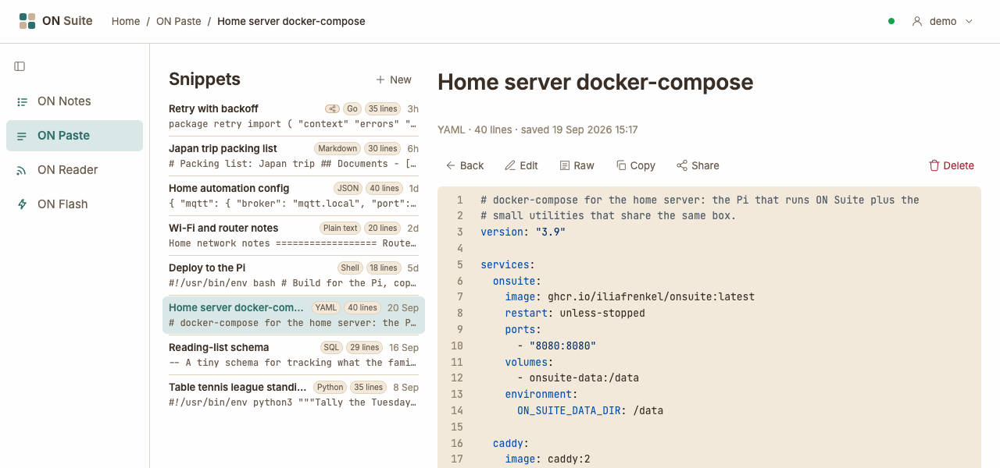
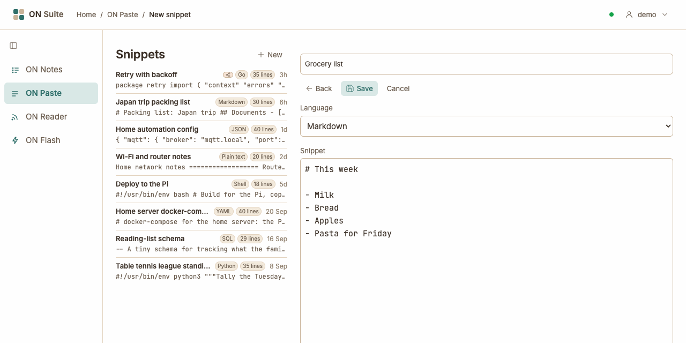
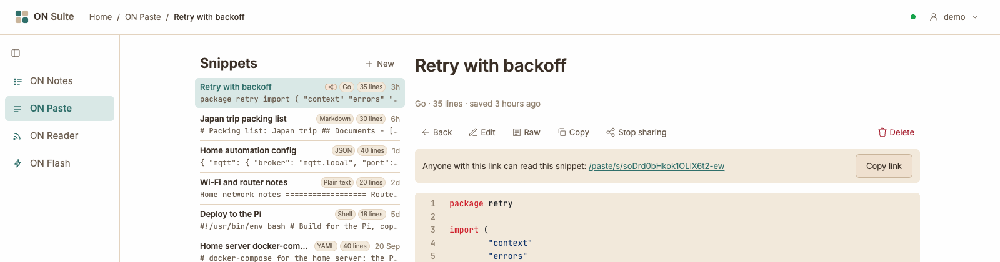
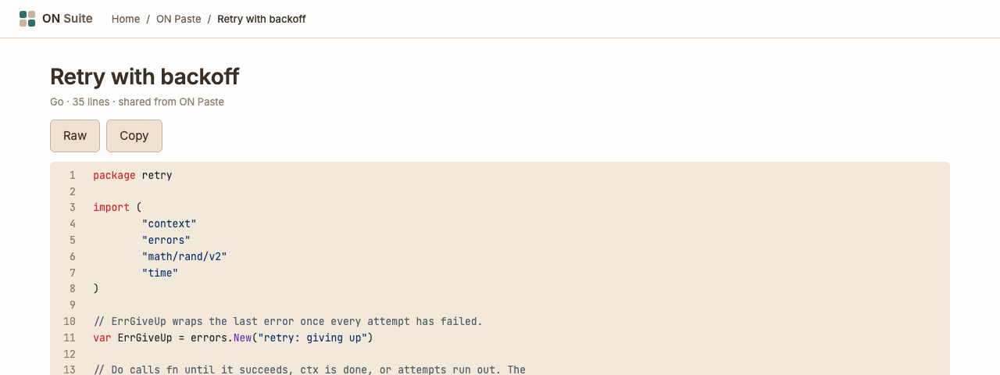

# ON Paste

ON Paste is a place to keep bits of text you want to find again: a shopping
list, notes about your home Wi-Fi, a config file or a piece of code. Code gets
colour highlighting so it's easy to read. Your snippets are private to you,
and you can share any one of them with a link when you want someone else to
see it.

## Quick tour

- **Snippets** on the left — every snippet you've saved, newest first.
  Click one to open it.
- **New** at the top of the list — start a new snippet.
- **The open snippet** on the right — its title, a line such as
  **YAML · 40 lines · saved 19 Sep 2026 15:17**, the buttons for what you can
  do with it, and the snippet itself with line numbers. For a snippet from
  the last week, the date reads like **saved 3 hours ago**.

Until you pick a snippet, the right side says **Select a snippet to view
it.**

On a phone there isn't room for both sides, so you see the list first.
Tap a snippet to open it, and tap **Back** to return to the list. On a
computer, **Back** simply closes the snippet.

## Creating a snippet

1. Click **New** at the top of the list.
2. Type a title in the box at the top. It's optional: a snippet without one
   is called **Untitled**.
3. Pick a **Language**, or leave it on **Detect automatically** (see
   [Syntax highlighting and languages](#syntax-highlighting-and-languages)).
4. Type or paste your text into the **Snippet** box.
5. Click **Save**.

Your new snippet opens straight away and appears at the top of the list.
Click **Cancel** instead to leave without saving.

If something's wrong, a message appears above the form and your text stays
where it is so you can fix it:

- **The snippet is empty.** — the **Snippet** box needs some text.
- **The title is longer than 120 characters.** — shorten the title.
- **The snippet is larger than 256 KiB.** — the text is too big for one
  snippet. That's a very long document; split it into a few snippets.

## Finding your snippets

Each snippet in the list takes two lines:

- **The first line** shows the title, then small labels:
  - a share icon, if the snippet is shared with a link (see
    [Sharing a snippet](#sharing-a-snippet));
  - the language, such as **Go** or **Markdown** (there's no label for
    **Detect automatically**);
  - the length, such as **35 lines**;
  - when you created it: **3h** or **2d** for recent snippets, or a date
    such as **20 Sep** for older ones. Hover over it to see the exact date
    and time.
- **The second line** is a preview of the first part of the snippet.

Long titles are cut short with **…** in the list; open the snippet to see
the whole title. The snippet you have open is highlighted.

## Editing and deleting

To change a snippet, open it and click **Edit**. You can change the title,
the **Language** and the text. Click **Save** to keep your changes, or
**Cancel** to leave the snippet as it was.

Editing doesn't change the "saved" date: it always shows when you first
created the snippet, and the snippet keeps its place in the list. If the
snippet is shared, people with the link see your changes straight away.

To delete a snippet, open it and click **Delete**. ON Suite asks you to
confirm, for example **Delete “Grocery list”? This cannot be undone.** Click
**OK** to delete it. A deleted snippet is gone for good, and if it was
shared, its link stops working too.

## Syntax highlighting and languages

ON Paste colours your snippet to match the language you pick, so code and
config files are easier to read. The colours follow your light or dark
theme.

**Detect automatically** is the default: ON Paste looks at your text and
makes its best guess. The snippet's details show the detected language (or
leave it off if no language was recognized). If the colours look wrong,
click **Edit** and pick the language yourself. For ordinary writing, such
as a list or a note, choose **Plain text**.

The **Language** menu offers:

- **Detect automatically** and **Plain text**
- **Shell**, **PowerShell** and **Dockerfile**
- **C**, **C++**, **Go**, **Java**, **Lua**, **PHP**, **Python**,
  **Ruby** and **Rust**
- **HTML**, **CSS**, **JavaScript** and **TypeScript**
- **JSON**, **XML**, **YAML**, **INI / TOML**, **Markdown** and **Diff**
- **SQL**, **nginx** and **Terraform**

## Copying and downloading

Open a snippet and use the buttons above it:

- **Copy** — copies the snippet's text, without the colours or line
  numbers, so you can paste it somewhere else. The button briefly says
  **Copied**.
- **Raw** — opens the snippet as plain text on its own page. To download
  it, use your browser's save command (`Ctrl`+`S`, or `Cmd`+`S` on a Mac).
  The browser suggests a simple file name made from the snippet's number,
  such as `paste-9.txt`.

## Sharing a snippet

Sharing gives a snippet a secret link. Anyone who has the link can read that
one snippet, even without an ON Suite account. Nobody can find it without
the link, and nothing else of yours is shared.

1. Open the snippet and click **Share**.
2. A box appears: **Anyone with this link can read this snippet:** followed
   by the link.
3. Click **Copy link** and paste the link into a message, an email or
   wherever you like.

A shared snippet has a share icon in the list, so you can see at a glance
which ones are shared.

### What people with the link see

They see the title, the language, the number of lines and the words
**shared from ON Paste**, then the snippet itself. They have their own
**Raw** and **Copy** buttons, but they can't edit or delete it,
and they can't see your other snippets.

### Stopping sharing

Open the snippet and click **Stop sharing**. The link stops working
immediately: anyone who tries it sees **404 — Not found**.

If you click **Share** again later, the snippet gets a brand-new link. The
old link stays dead, so only people you give the new link to can read it.

## Exporting your snippets

ON Paste doesn't have an export button. The admin can export your ON
Notes, ON Paste and ON Reader data as a single file for you. Ask them if
you'd like a copy (the
[Admin guide](admin.md#exporting-someones-data) explains how).

Back to [all guides](index.md).
