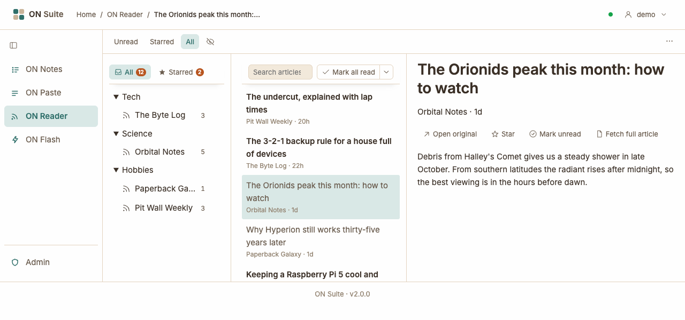
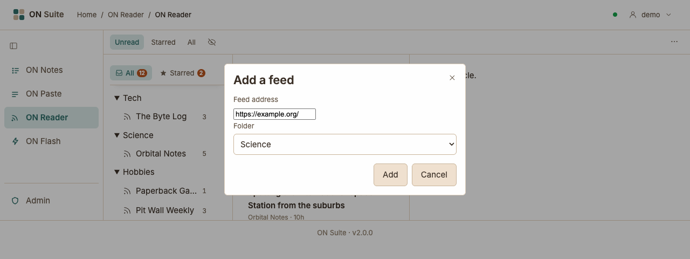
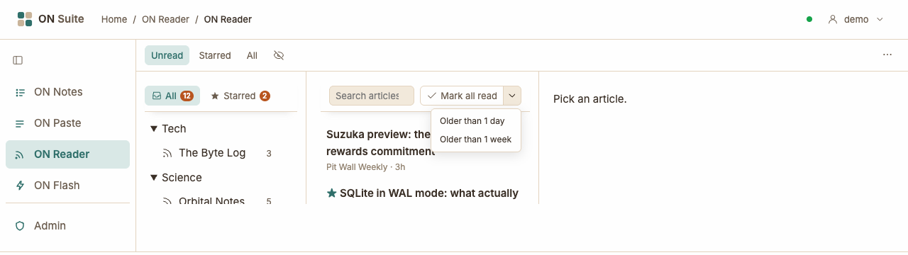
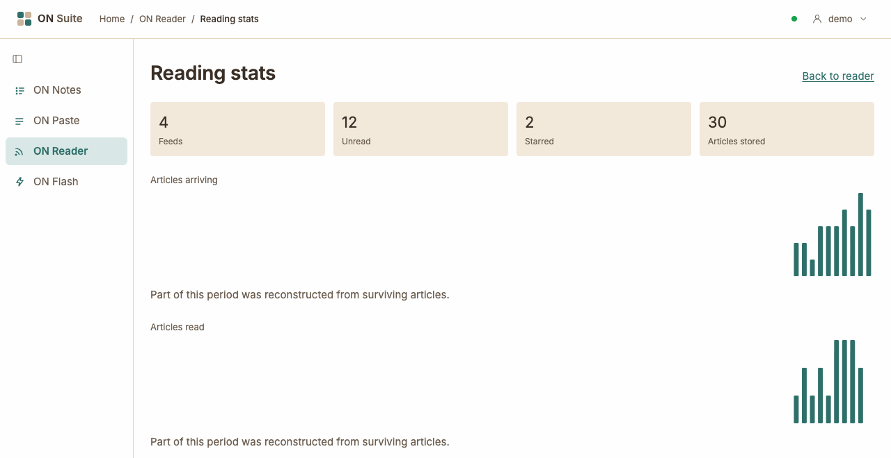

# ON Reader

ON Reader brings the latest articles from your favourite websites into one
place, so you don't have to visit each site to see what's new. It works with
feeds: a feed is a list of a website's newest articles that the site
publishes for reader apps like this one. Most news sites, blogs and podcasts
have one. You add the sites you like, and ON Reader checks them for you and
shows what you haven't read yet. What you follow and read is private to you.

## Quick tour

- **The toolbar** along the top:
  - **Unread**, **Starred** and **All** — narrow the list down to unread
    articles, starred articles, or show everything (see
    [Finding articles](#finding-articles)).
  - **The eye button** with a line through it — hide feeds that have
    nothing unread.
  - **···** on the right — the menu, with **Add feed…**, **Import OPML…**,
    **Export OPML**, **New folder…**, **Refresh all feeds**, **Reading
    stats** and **Keyboard shortcuts**.
- **The feeds** on the left:
  - **All** — articles from every feed. Its number counts everything
    unread.
  - **Starred** — articles you've starred. Its number counts all your
    starred articles.
  - Your feeds, grouped into folders. The number after a feed counts its
    unread articles. The small picture in front is the site's own icon, if it
    has one.
- **The articles** in the middle — newest first, with the feed's name and
  how long ago each one was published, such as **3h** or **2d**. Unread
  articles are in bold. A **★** marks a starred article.
- **The open article** on the right. Until you pick one, it says **Pick an
  article.**

### Resizing the panes

Drag the thin line between two panes to make one wider or narrower. ON
Reader remembers the widths on this browser. Without a mouse, press `Tab`
until the line is selected, then press `←` or `→` to move it.

### On a phone or small screen

On a narrow screen there isn't room for three panes, so ON Reader shows one
or two at a time. You start on the list of articles. Tap an article to read
it, and tap **Articles** to go back to the list. From the list, tap
**Feeds** to see your feeds.

## Adding a feed

1. Click **···** in the toolbar and choose **Add feed…**.
2. In **Feed address**, paste the address of the website, such as
   `https://example.org/`. If you know the address of the feed itself, that
   works too.
3. Choose a **Folder** to put it in, or leave it on **(no folder)**.
4. Click **Add**.

ON Reader finds the site's feed for you and fetches its latest articles
straight away, which can take a few seconds. The new feed then opens, ready
to read.

If the site has more than one feed, for example one per topic, you see
**Choose a feed** with **That page offers more than one feed. Which one?**
Click the one you want.

If something goes wrong, a message appears above the panes:

- **That is not a web address. It needs to start with http:// or https://.**
  — check you pasted the whole address.
- **No feed found at that address.** — the site doesn't seem to have a feed.
  Look on the site for a link called "RSS" or "Feed" and paste that address
  instead.
- **That address could not be reached.** — the site didn't answer. Check the
  address, or try again later.

If someone else in your household already follows the same feed, you only
see its articles from now on, not the ones that arrived before you added it.

## Organising your feeds

### Folders

Folders keep related feeds together, such as "News" or "Hobbies".

- **To make a folder:** click **···** in the toolbar, choose **New
  folder…**, type a **Folder name** and click **Create folder**.
- **To put a feed in a folder:** choose the folder when you add the feed.
  At the moment, ON Reader can't move a feed to a different folder once it's
  added.
- **To fold a folder away:** click its name. Click it again to open it.
- **To delete a folder:** point at it, click **···** next to its name and
  choose **Delete**. ON Reader asks **Delete the folder “Hobbies”? Its feeds
  move to the root.** Click **Confirm**. The feeds aren't deleted: they move
  out of the folder to the bottom of the list.

To see only feeds that have something new, click the eye button in the
toolbar. Feeds with nothing unread are hidden, along with any folder left
empty. Click it again to show everything. ON Reader remembers your choice
on this browser.

### The feed menu

Point at a feed and click **···** to open its menu:

- **Feed URL** — copy the feed's address, for example to share it with
  someone. The button briefly says **Copied!**.
- **Refresh feed** — check this feed for new articles right now.
- **Rename…** — give the feed a name you prefer. Type it in **Name** and
  click **Rename**. To go back to the feed's own name, clear the box and
  click **Rename**.
- **Unsubscribe** — stop following the feed. ON Reader asks you to confirm,
  for example **Unsubscribe from “Pit Wall Weekly”?** Click **Confirm**. The
  feed and its articles disappear from your lists, including any articles
  from it that you starred.

## Reading articles

Click an article in the list to open it on the right. Opening an article
marks it as read.

The open article shows its title, the feed's name, the author (if the feed
says) and when it was published. The buttons under the title:

- **Open original** — open the article on its own website, in a new tab.
- **Star** — keep the article to come back to later. The button then says
  **Starred**; click it again to remove the star.
- **Mark unread** — put the article back into your unread list, for
  example if you want to finish it later. It then says **Mark read**, to
  mark it read again.
- **Fetch full article** — see [Reading the whole article](#reading-the-whole-article).

Pictures in articles load through ON Suite rather than straight from the
website, so the sites you follow don't see your device or your address.

### Reading the whole article

Many feeds include only the first few lines of each article. To read the
rest without leaving ON Reader, click **Fetch full article**. ON Reader
fetches the article's page and shows just the article, without the site's
menus and adverts.

Once it has the full article:

- **Show feed version** switches back to the short version from the feed,
  and **Show full article** switches to the full one again.
- **Discard extraction** throws the full article away, for example if
  what came back was a "please subscribe" page rather than the article. You
  can then try **Fetch full article** again.

Some pages can't be read this way, such as articles behind a paywall. You
then see a message such as **could not find an article in that page — it
may be a paywall, or built by JavaScript** or **could not fetch the page**.
Click **Open original** to read it on the website instead. Trying again
within an hour just shows the same message.

## Finding articles

### Choosing what the list shows

The list shows articles from what you've picked on the left: **All**,
**Starred**, or one feed. The buttons in the toolbar then narrow it down:

- **Unread** — only articles you haven't read. This is what you see
  whenever you pick something on the left.
- **Starred** — only starred articles.
- **All** — everything, read or not.

So **Starred** on the left starts out showing only the starred articles you
haven't read yet; click **All** in the toolbar to see every starred article.

If there's nothing to show, the list says so, for example **Nothing unread
here. Try the All filter.** The list shows up to the newest 200 articles.

### Searching

Type into **Search articles…** at the top of the list, or press `/` to jump
there. The list narrows down as you type.

- ON Reader looks in the titles and the text of articles, including full
  articles you've fetched.
- Words match from their start: `rocket` finds "rockets".
- With several words, an article must contain all of them.
- The search only looks through the list you're viewing. To search every
  article, including ones you've read, pick **All** on the left and **All**
  in the toolbar first.

If nothing matches, you see **Nothing matches** followed by your search.
Clear the box to see the whole list again.

## Marking articles read

Opening an article marks it read, and **Mark unread** puts it back. To catch
up in one go, use **Mark all read** at the top of the list.

- Click **Mark all read** to mark every article in what you've picked on
  the left (**All**, **Starred** or one feed) as read.
- Click the small arrow next to it and choose **Older than 1 day** or
  **Older than 1 week** to mark only articles published before then. Newer
  articles stay unread.

**Mark all read** marks everything in the feed or view you've picked, even
articles hidden by a search or by the toolbar buttons. There's no undo, but
you can still open any article and click **Mark unread**.

## Keeping your feeds up to date

ON Reader checks each feed for new articles about every half hour, even
while you're away. You don't need to do anything.

- **Refresh feed** in a feed's menu checks that feed right now.
- **Refresh all feeds** in the toolbar's **···** menu checks every feed
  that's due for its regular check. A feed checked in the last half hour or
  so is skipped, so to check one of those right away, use **Refresh feed**.

If ON Reader can't reach a feed, a **⚠** appears next to its name. Point at
it to see what went wrong. ON Reader keeps trying, less often the longer the
problem lasts (at least every six hours or so). The **⚠** goes away once a
check works again. If it stays for days, the site may have moved its feed:
unsubscribe and add the site again.

### What happens to old articles

Once a day, ON Reader tidies up. Articles that you've read and that were
published more than 60 days ago are removed. It never removes:

- **starred articles**, however old — star anything you want to keep;
- **unread articles**, however old.

If someone else in your household follows the same feed, an article is kept
until they've read it too.

## Moving your feeds to or from another app

If you already use another feed reader, you can bring your feeds across in
one go. Most feed readers can save your list of feeds as an OPML file (a
standard file format for lists of feeds), and ON Reader can read and write
one.

### Importing feeds

1. In your old reader, export your feeds as an OPML file (the file usually
   ends in `.opml` or `.xml`).
2. In ON Reader, click **···** and choose **Import OPML…**.
3. Choose the file under **OPML file** and click **Import**.

ON Reader tells you what happened, such as **Added 12, 2 already
subscribed, 1 could not be added.** Folders in the file become folders in
ON Reader. Nothing you already follow is removed. The new feeds fill up with
articles over the next few minutes; choose **Refresh all feeds** if you
don't want to wait.

If the file isn't right, you see **That does not look like an OPML file.**
or **That file is too large to be a subscription list.** If you click
**Import** without choosing a file, you see **Choose an OPML file to
import.**

### Exporting feeds

Click **···** and choose **Export OPML**. Your browser downloads a file
called `reader-subscriptions.opml`, usually into your Downloads folder, with
all your feeds, their names and their folders. You can import it into
another feed reader, or keep it as a backup. It lists your feeds only, not
the articles or what you've read.

The admin can also export all your ON Suite data, including your feeds, as
a single file for you. Ask them if you'd like a complete copy (the Admin
guide explains how).

## Reading stats

Click **···** and choose **Reading stats** to see how you've been keeping
up. Click **Back to reader** to return.

- **The boxes at the top** — how many **Feeds** you follow, how many
  articles are **Unread** and **Starred**, and how many are kept in ON
  Reader (**Articles stored**).
- **Articles arriving** and **Articles read** — one bar per day for the
  last 90 days. Point at a bar to see the date and number.
- **Backlog** — how many unread articles you had each day. It says
  **Nothing yet.** until ON Reader has recorded a few days.
- **Daily figures** — click to see the same numbers as a table.
- **Feeds** — a table of every feed with its number of articles, how many
  you've read (**Read ratio**) and the date of its **Last article**.
- **Gone quiet** — feeds that haven't published anything in over 60 days.
- **Rarely read** — feeds with plenty of articles that you almost never
  read. They may be worth unsubscribing from.

**Gone quiet** and **Rarely read** only appear when there's something to
show. If you see **Part of this period was reconstructed from surviving
articles.**, some early days were worked out from the articles ON Reader
still has, so they may be a little low.

## Keyboard shortcuts

These work when you're not typing in a box (except `Esc`). Click **···**
and choose **Keyboard shortcuts** for a quick reminder.

| Key | What it does |
|-----|--------------|
| `j` | Highlight the next article in the list |
| `k` | Highlight the previous article in the list |
| `o` or `Enter` | Open the highlighted article |
| `m` | Mark the open article read or unread |
| `s` | Star the open article, or remove its star |
| `r` | Refresh all feeds |
| `/` | Jump to the search box |
| `Esc` | Leave the search box; close the **···** menu or a box |
| `←` / `→` | With the line between two panes selected (using `Tab`): move it left or right |

Moving with `j` and `k` doesn't mark articles read; only opening one does.

Back to [all guides](index.md).
